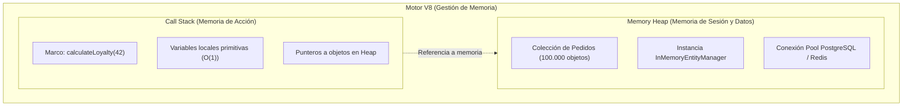
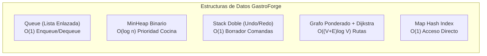
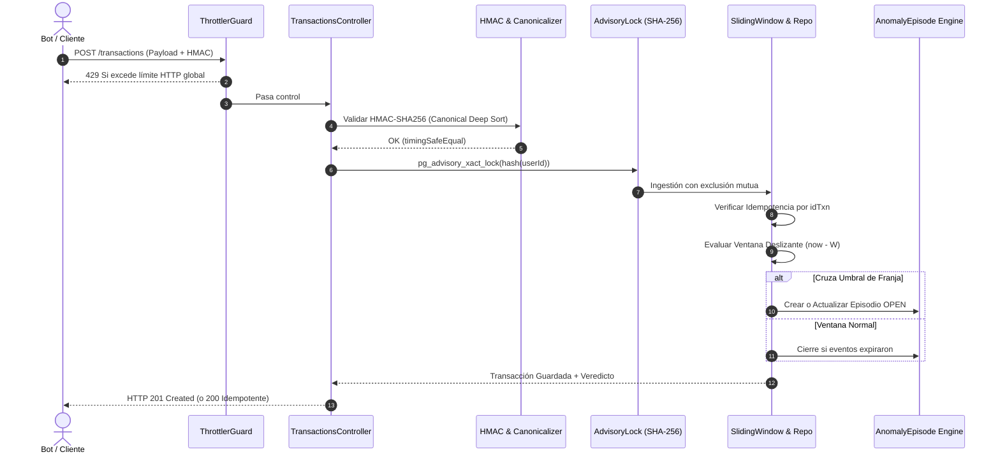
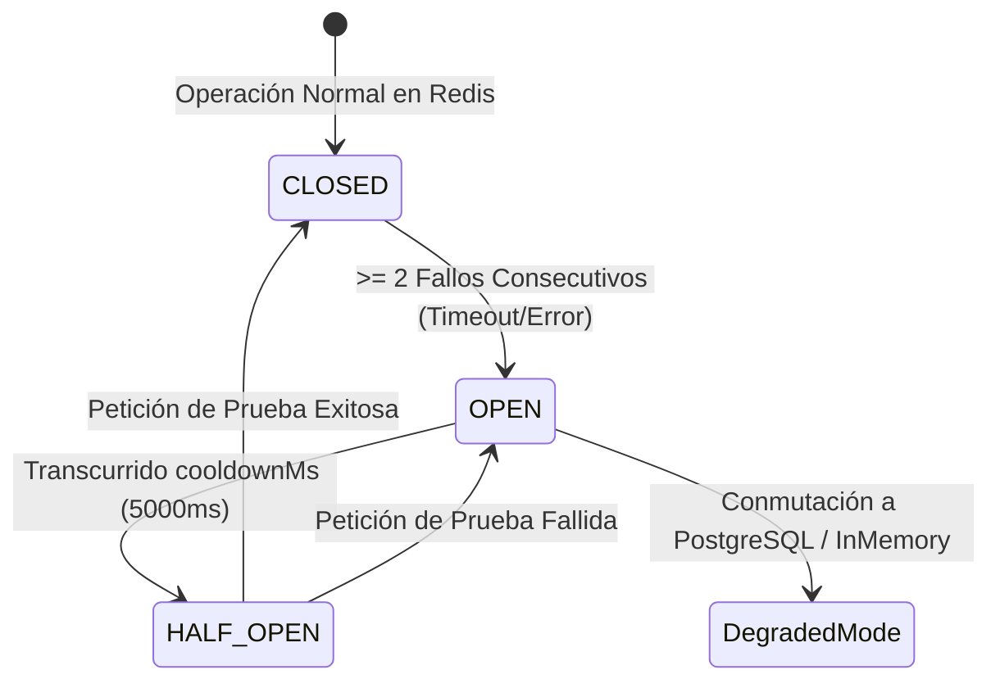
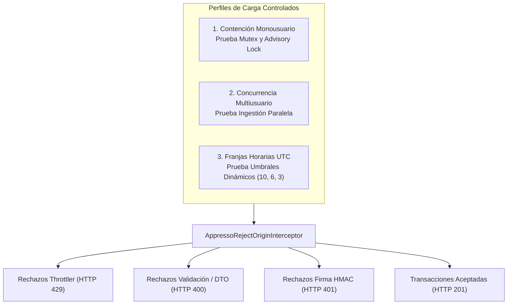

# INFORME ACADÉMICO Y DE INGENIERÍA DE SOFTWARE
## Sistema GastroForge-Academic & Plataforma Transaccional Appresso
### De la Complejidad Asintótica a la Detección de Fraude en Tiempo Real de Alta Concurrencia

---

| **Parámetro** | **Detalle Institucional y de Proyecto** |
|---|---|
| **Institución Académica** | Institución Universitaria Pascual Bravo |
| **Facultad / Programa** | Facultad de Ingeniería / Ingeniería de Software |
| **Asignatura** | Programación Avanzada |
| **Proyecto Integrador** | GastroForge-Academic (`Appresso: Tu café, a un tap`) |
| **Entorno de Producción** | [https://gastroforge-academic.onrender.com](https://gastroforge-academic.onrender.com) |
| **Documentación OpenAPI (Swagger)** | [https://gastroforge-academic.onrender.com/docs#/](https://gastroforge-academic.onrender.com/docs#/) |
| **Arquitectura del Repositorio** | Monorepo de dos espacios de trabajo (`backend/` NestJS + `frontend/` React) |

---

## ÍNDICE GENERAL

1. [Resumen Ejecutivo (Abstract)](#1-resumen-ejecutivo-abstract)
2. [Contexto Operativo y Planteamiento del Problema](#2-contexto-operativo-y-planteamiento-del-problema)
3. [Marco Teórico y Fundamentos Algorítmicos](#3-marco-teórico-y-fundamentos-algorítmicos)
   - 3.1. Gestión de Memoria: Variables de Acción vs. Variables de Sesión (Stack vs. Heap)
   - 3.2. Notación Asintótica Big O y Metodología de las 7 Preguntas Clave
   - 3.3. Invarianza del Conteo de Operaciones Elementales frente a la Volatilidad Temporal (`elapsedMs`)
4. [Evolución y Desarrollo Metodológico del Sistema](#4-evolución-y-desarrollo-metodológico-del-sistema)
   - 4.1. Unidad 1: Análisis Asintótico y Modelos Matemáticos
   - 4.2. Unidad 2: Estructuras de Datos Avanzadas en Gestión Gastronómica
   - 4.3. Unidad 3: Motor Transaccional y Detección de Fraude con Ventana Deslizante (Appresso)
   - 4.4. Unidad 4: Persistencia Relacional Durable en PostgreSQL (Neon) y Concurrencia
   - 4.5. Unidad 5: Capa de Estado Efímero con Redis, Script Lua y Resiliencia con Circuit Breaker
   - 4.6. Unidad 6: Read Model Analítico, Dashboard SPA y Erradicación de Layout Shift (CLS = 0)
   - 4.7. Unidad 7: Simulación de Carga Masiva (Bots) y Verificación de SLOs
5. [Matriz Maestra de Decisiones Técnicas y Justificación ("El Por Qué")](#5-matriz-maestra-de-decisiones-técnicas-y-justificación-el-por-qué)
6. [Conclusiones Académicas y Profesionales](#6-conclusiones-académicas-y-profesionales)
7. [Referencias Bibliográficas](#7-referencias-bibliográficas)

---

## 1. RESUMEN EJECUTIVO (ABSTRACT)

El presente documento documenta de forma exhaustiva el ciclo de vida del proyecto **GastroForge-Academic**, desarrollado en el marco de la asignatura **Programación Avanzada** de la **Institución Universitaria Pascual Bravo**. La actividad inició como un ejercicio de laboratorio para comparar empírica y matemáticamente órdenes de complejidad asintótica ($O(1)$, $O(\log n)$, $O(n)$, $O(n^2)$) sobre pedidos generados en memoria mediante algoritmos deterministas.

A lo largo del semestre, el proyecto evolucionó hacia un caso real de ingeniería de software de misión crítica: la plataforma de pagos y pedidos digitales **"Appresso (Tu café, a un tap)"**. El desafío consistió en transformar un prototipo susceptible a saturación por ráfagas concurrentes de tráfico en una arquitectura distribuida, resiliente y de alto rendimiento. Dicha arquitectura es capaz de procesar transacciones firmadas con criptografía `HMAC-SHA256`, detectar fraudes y abusos mediante algoritmos de **ventana deslizante temporal** en tiempo constante amortizado, garantizar la exclusión mutua distribuida con **bloqueos transaccionales consultivos** (`pg_advisory_xact_lock`), ofrecer redundancia operativa mediante un **Circuit Breaker** frente a fallos en Redis, y exponer la telemetría en un **Dashboard reactivo** con métricas de estabilidad visual estrictas (Cumulative Layout Shift, CLS = 0).

Se exponen con rigor matemático todas las deducciones analíticas, las decisiones de compromiso (*trade-offs*) adoptadas en cada etapa y la justificación técnica de cada desviación del diseño original.

---

## 2. CONTEXTO OPERATIVO Y PLANTEAMIENTO DEL PROBLEMA

### 2.1. El Caso de Negocio: Appresso
Appresso es una solución de comercio electrónico gastronómico que permite a clientes ordenar café y alimentos desde sus dispositivos móviles con retiro exprés en barra. En su diseño operativo conviven dos realidades técnicas:

1. **La Operación en Salón y Cocina:** Requiere equidad de atención (cola FIFO de comandas), optimización del orden de despacho según criticidad y demoras acumuladas (cola de prioridad en cocina), reversibilidad en la edición de borradores (pilas Undo/Redo) y despacho eficiente de meseros hacia las mesas (rutas mínimas en grafos espaciales).
2. **La Pasarela Transaccional y Detección de Abusos:** Expuesta a redes públicas, susceptible a ataques de bots que generan micro-transacciones masivas para eludir límites de compra, explotar promociones o denegar el servicio (*DoS*). 

### 2.2. La Falla de Escalabilidad
En las versiones tempranas de cualquier sistema de software comercial, los desarrolladores resuelven la lógica mediante construcciones elementales (`Array.find`, bucles anidados `for` para buscar duplicados, o consultas repetitivas de agregación). Con $n \le 100$ transacciones, el costo computacional es despreciable. No obstante, al someter el sistema a ráfagas de $10.000$ o $100.000$ operaciones simultáneas:
- La búsqueda secuencial satura los hilos de CPU.
- Los algoritmos de doble recorrido cuadrático ($O(n^2)$) escalan a miles de millones de comparaciones, congelando el *Event Loop* de Node.js.
- La recursión lineal desborda la pila de llamadas (*Call Stack Overflow*).
- Las operaciones concurrentes sobre un mismo usuario generan condiciones de carrera (*race conditions*), multiplicando los conteos de la ventana de fraude o provocando inconsistencias en el balance.

Como sentencia el Departamento de Ciencias de la Computación de la Universidad de Stanford (CS103):
> *"El hecho de que un problema sea decidible no significa que los algoritmos que tenemos para resolverlo sean eficientes en la práctica."*

---

## 3. MARCO TEÓRICO Y FUNDAMENTOS ALGORÍTMICOS

### 3.1. Gestión de Memoria: Variables de Acción vs. Variables de Sesión (Stack vs. Heap)
Todo cálculo en un entorno como el motor JavaScript V8 (Node.js) demanda memoria física administrada en dos estructuras fundamentales: la **Pila de Ejecución (*Call Stack*)** y el **Montículo de Memoria (*Memory Heap*)**.



- **Variables de Acción (Memoria a Corto Plazo / Ámbito de Petición):**
  Son asignadas dentro del marco de una función (p. ej., contadores locales de un bucle, acumuladores temporales o parámetros de una consulta HTTP). Viven en el *Call Stack* o son elegibles para recolección inmediata por el *Garbage Collector* de V8 una vez finaliza la llamada. Su impacto en memoria es $O(1)$ respecto a la persistencia del sistema.
- **Variables de Sesión (Memoria a Largo Plazo / Ámbito de Proceso):**
  Persisten mientras el servidor esté en ejecución (p. ej., clientes de base de datos, caché en memoria de usuarios, mapas de bloqueo de concurrencia). Si una colección en el Heap acumula eventos indefinidamente sin una política de purga o TTL (*Time To Live*), la memoria escala proporcionalmente a $O(n)$, provocando fragmentación y finalmente un fallo catastrófico por falta de memoria (*Out of Memory - OOM Kill*).

### 3.2. Notación Asintótica Big O y Metodología de las 7 Preguntas Clave
La notación asintótica proporciona una cota superior formal del crecimiento de un algoritmo a medida que el tamaño de la entrada tiende a infinito ($n \to \infty$):
- **$O(1)$ (Costo Constante):** Independiente de $n$. Ejemplo: cálculo analítico de semanas en progresión aritmética o acceso a una tabla hash.
- **$O(\log n)$ (Costo Logarítmico):** Divide el espacio de búsqueda en cada paso. Ejemplo: flotación en un árbol binario (`MinHeap`) o partición balanceada.
- **$O(n)$ (Costo Lineal):** Escala en razón directa a $n$. Ejemplo: suma acumulativa de productos.
- **$O(n^2)$ (Costo Cuadrático):** Bucles anidados dependientes. Ejemplo: comparación de todos los pares posibles.

Para guiar la auditoría de cada función desarrollada, se institucionalizó la **Metodología de las 7 Preguntas Clave de la IU Pascual Bravo**:
1. *¿Cuál es el tamaño de la entrada?* ($\rightarrow n$).
2. *¿Cuántas veces se ejecuta cada operación fundamental?*
3. *¿Existen bucles anidados dependientes o independientes?*
4. *¿La estructura de datos se divide de forma balanceada?*
5. *¿Existe recursividad y cuál es la cota de su profundidad en la pila?*
6. *¿Se instancian estructuras de datos auxiliares que incrementen el costo espacial?*
7. *¿Cómo se comporta el consumo de CPU y latencia cuando $n$ pasa de $10$ a $100.000$?*

### 3.3. Invarianza del Conteo de Operaciones Elementales frente a la Volatilidad Temporal (`elapsedMs`)
Una de las exigencias pedagógicas centrales consistió en:
> *"No fundamentar el análisis exclusivamente en el tiempo en milisegundos (`elapsedMs`), sino contabilizar las operaciones ejecutadas."*

La medición temporal mediante `performance.now()` presenta ruido incontrolable:
- Planificación del sistema operativo y ciclos de reloj compartidos en contenedores de nube (Render).
- Pausas imprevistas por la recolección de basura (*Stop-The-World GC* de V8).
- Fluctuaciones térmicas y *throttling* de CPU.

En contraste, el **conteo explícito de operaciones elementales** (comparaciones de punteros, lecturas de memoria, intercambios en montículos) es una **métrica determinista e invariante a la máquina**. Si $n = 1.000$, un bucle de comparación de pares únicos ejecutará exactamente $499.500$ operaciones en una supercomputadora, en un servidor de Render o en una máquina local. Esto constituye una validación matemática irrebatible de la cota $O(n^2)$.

---

## 4. EVOLUCIÓN Y DESARROLLO METODOLÓGICO DEL SISTEMA

### 4.1. Unidad 1: Análisis Asintótico y Modelos Matemáticos

#### 4.1.1. Generador Pseudoaleatorio Determinista (LCG)
Para asegurar que las pruebas fueran reproducibles sin requerir semillas aleatorias erráticas, se diseñó un Generador Congruencial Lineal (LCG) en [`backend/src/modules/academic-analysis/algorithms/order-generator.ts`](file:///c:/Users/User/Desktop/Programacion/GastroForge-Academic/backend/src/modules/academic-analysis/algorithms/order-generator.ts) con semilla inmutable `20260901`:
$$X_{k+1} = (a X_k + c) \pmod m$$
Cualquier llamada con el mismo tamaño $n$ produce de forma exacta la misma secuencia de pedidos, permitiendo contrastar experimentos entre distintos integrantes del equipo o frente al docente evaluador.

#### 4.1.2. Búsqueda Lineal y Agregación
- **Búsqueda Secuencial:** Localizar un pedido por `id` sobre un arreglo desordenado.
  - *Mejor Caso:* $O(1)$ (1 comparación si coincide con el índice 0).
  - *Caso Promedio:* $O(n/2) \implies O(n)$ (aprox. 50.000 comparaciones para $n=100.000$).
  - *Peor Caso:* $O(n)$ ($100.000$ comparaciones si está al final o no existe).
- **Agregación Iterativa:** Recorrido simple acumulando el total de productos procesados en tiempo $O(n)$ y memoria espacial $O(1)$.

#### 4.1.3. Agregación Recursiva: Divide y Vencerás vs. Recursión Lineal
La implementación de una recursión ingenua sobre colecciones masivas constituye una vulnerabilidad crítica:
$$T(n) = T(n - 1) + O(1)$$
En Node.js, el *Call Stack* colapsa con $10.000 \sim 15.000$ marcos de pila, disparando `RangeError: Maximum call stack size exceeded`.

Para subsanarlo, se diseñó una descomposición por **Divide y Vencerás (D&C)** en [`backend/src/modules/academic-analysis/algorithms/recursive-analysis.ts`](file:///c:/Users/User/Desktop/Programacion/GastroForge-Academic/backend/src/modules/academic-analysis/algorithms/recursive-analysis.ts):
$$T(n) = 2T(n/2) + O(1)$$
- La complejidad temporal total permanece en $O(n)$ (visita todas las hojas del árbol).
- La profundidad de la pila queda acotada logarítmicamente:
  $$\text{Profundidad Máxima} = \lceil \log_2(n) \rceil + 1$$
  - Para $n = 10 \implies 4$ marcos.
  - Para $n = 1.000 \implies 10$ marcos.
  - Para $n = 100.000 \implies \mathbf{18\text{ marcos de llamada}}$.
Esto permite procesar $100.000$ elementos sin ningún riesgo de desbordamiento de pila.

#### 4.1.4. Comparación de Pares, Deducción de Gauss y Salvaguarda de Recursos
Al comparar pedidos $(i, j)$ con $j > i$ para identificar transacciones del mismo cliente:
$$S_n = (n - 1) + (n - 2) + \dots + 1 = \sum_{k=1}^{n-1} k = \frac{n(n - 1)}{2} = \frac{n^2 - n}{2}$$
Para $n = 100.000$, la cantidad de operaciones requeridas asciende a:
$$\frac{100.000 \times 99.999}{2} = 4.999.950.000\text{ comparaciones}$$
Ejecutar casi cinco mil millones de iteraciones en un único hilo de Node.js congelaría el contenedor durante más de 6 minutos, provocando un *Gateway Timeout* (HTTP 504) o reinicio forzoso.

**Decisión Técnica de Salvaguarda:**
En [`backend/src/modules/academic-analysis/algorithms/quadratic-analysis.ts`](file:///c:/Users/User/Desktop/Programacion/GastroForge-Academic/backend/src/modules/academic-analysis/algorithms/quadratic-analysis.ts):
- Si $n \le 2.000$, se ejecuta físicamente el doble ciclo ($1.999.000$ comparaciones reales) demostrando el costo.
- Si $n > 2.000$, el sistema no bloquea el hilo; calcula el resultado exacto mediante la ecuación de Gauss en tiempo $O(1)$, retornando el indicador `executed: false` junto a `estimatedOperations`, educando al consumidor de la API sobre la no-escalabilidad cuadrática.

#### 4.1.5. Progresión Aritmética de Fidelización
Modelado de la cliente frecuente con incremento constante ($a_1 = 2$, $d = 2$, término general $a_n = 2n$):
Despeje algebraico analítico:
$$n = \frac{\text{objetivo} - a_1}{d} + 1 = \frac{\text{objetivo}}{2}$$
- Para $42$ productos: Semana $21$.
- Para $72$ productos: Semana $36$.
- Para $120$ productos: Semana $60$.
Implementado en tiempo constante **$O(1)$** en lugar de un bucle iterativo $O(n)$, demostrando la superioridad del análisis matemático sobre la computación bruta.

#### 4.1.6. Regresión Lineal por Mínimos Cuadrados Ordinarios (OLS)
Ajuste de serie temporal histórica de 14 días ($x \in [1, 14]$) en [`backend/src/modules/academic-analysis/algorithms/linear-regression.ts`](file:///c:/Users/User/Desktop/Programacion/GastroForge-Academic/backend/src/modules/academic-analysis/algorithms/linear-regression.ts):
$$y = mx + b \implies y = 5.6330x + 122.3956 \quad (R^2 = 0.5595)$$
Proyecciones de ventas futuras con complejidad temporal $O(N + K)$ y espacial $O(1)$:
- $+2$ días ($x = 16$): $212.52$ unidades.
- $+5$ días ($x = 19$): $229.42$ unidades.
- $+7$ días ($x = 21$): $240.69$ unidades.

---

### 4.2. Unidad 2: Estructuras de Datos Avanzadas en Gestión Gastronómica

El módulo [`backend/src/modules/structures/`](file:///c:/Users/User/Desktop/Programacion/GastroForge-Academic/backend/src/modules/structures/) aplicó estructuras especializadas para erradicar cuellos de botella en la operación:



1. **Cola FIFO con Lista Simplemente Enlazada ([`queue.ts`](file:///c:/Users/User/Desktop/Programacion/GastroForge-Academic/backend/src/modules/structures/data-structures/queue.ts)):**
   - *Problema:* El uso de `Array.prototype.shift()` en JavaScript tiene costo $O(n)$, pues desplaza todos los elementos hacia la izquierda tras cada extracción.
   - *Solución:* Lista con punteros `head` y `tail`, garantizando $O(1)$ estricto para `enqueue` y `dequeue`.
2. **Montículo Binario Mínimo ([`min-heap.ts`](file:///c:/Users/User/Desktop/Programacion/GastroForge-Academic/backend/src/modules/structures/data-structures/min-heap.ts)):**
   - *Problema:* Reordenar pedidos en cocina con `Array.prototype.sort()` tras cada comanda cuesta $O(n \log n)$.
   - *Solución:* Montículo binario balanceado con operaciones de flotación (`bubbleUp`) y hundimiento (`bubbleDown`) en $O(\log n)$.
   - *Regla Didáctica:* $\text{effectivePriority} = \text{basePriority} + \text{waitingMinutes}$. A mayor demora, mayor prioridad.
3. **Pilas Dobles Undo/Redo ([`stack.ts`](file:///c:/Users/User/Desktop/Programacion/GastroForge-Academic/backend/src/modules/structures/data-structures/stack.ts)):**
   - Dos instancias `Stack<Mutation>` en $O(1)$ para permitir deshacer y rehacer cambios en un borrador de pedido. Al registrar una mutación nueva tras un deshacer, el `redoStack` se vacía deterministamente para preservar la integridad del árbol de estados.
4. **Grafo Ponderado y Algoritmo de Dijkstra ([`weighted-graph.ts`](file:///c:/Users/User/Desktop/Programacion/GastroForge-Academic/backend/src/modules/structures/data-structures/weighted-graph.ts)):**
   - Cálculo del trayecto óptimo de los camareros entre Cocina, Barra, Salón y Terraza mediante lista de adyacencia y el `MinHeap` propio. Reduce la complejidad tradicional de matriz de adyacencia $O(V^2)$ a $O((V + E) \log V)$. Se validan aristas estrictamente no negativas para preservar la optimalidad Greedy de Dijkstra.
5. **Índice Map Hash vs. Recorrido Secuencial:**
   - Demostración de acceso directo $O(1)$ promedio mediante `Map.get(id)` frente a búsqueda lineal $O(n)$ en colecciones extensas.

---

### 4.3. Unidad 3: Motor Transaccional y Detección de Fraude con Ventana Deslizante (Appresso)

El subsistema transaccional [`backend/src/modules/appresso/`](file:///c:/Users/User/Desktop/Programacion/GastroForge-Academic/backend/src/modules/appresso/) implementa la ingestión segura y detección de actividad anómala.



#### 4.3.1. Algoritmo de Ventana Deslizante Temporal Puro
En [`backend/src/modules/appresso/fraud-detection/sliding-window.ts`](file:///c:/Users/User/Desktop/Programacion/GastroForge-Academic/backend/src/modules/appresso/fraud-detection/sliding-window.ts):
- Ventana configurable de tamaño $W = 3.000\text{ ms}$.
- Los eventos se evalúan según el tiempo de llegada al servidor (`receivedAt`), descartando la hora del cliente (`date`) para evitar ataques de alteración de reloj.
- **Borde Inclusivo:** Para un tiempo actual $T_{\text{now}}$, se conservan todos los eventos con:
  $$\text{receivedAt} \ge T_{\text{now}} - W$$
  El evento en $T_{\text{now}} - W$ **pertenece** a la ventana; el evento en $T_{\text{now}} - W - 1\text{ ms}$ queda formalmente excluido.
- Complejidad temporal: $O(1)$ amortizado al eliminar elementos vencidos desde la cabeza de la cola ordenada.

#### 4.3.2. Umbrales Dinámicos por Franja Horaria UTC (`TimeBandPolicy`)
Para modelar la variabilidad del tráfico entre horas pico y horas muertas, se diseñó la política en [`time-band-policy.ts`](file:///c:/Users/User/Desktop/Programacion/GastroForge-Academic/backend/src/modules/appresso/fraud-detection/time-band-policy.ts):
- **Mañana (05:00 a 12:00 UTC):** Umbral de tolerancia alto $\ge 10$ transacciones.
- **Tarde-Noche (12:00 a 20:00 UTC):** Umbral intermedio $\ge 6$ transacciones.
- **Noche-Madrugada (20:00 a 05:00 UTC):** Umbral estricto $\ge 3$ transacciones.

#### 4.3.3. Contrato Criptográfico HMAC-SHA256 e Idempotencia Estricta
- **Canonicalización Profunda:** Dado que `JSON.stringify` no garantiza el orden de las propiedades en JavaScript, se construyó una función de ordenamiento lexicográfico recursivo de claves en [`backend/src/modules/appresso/crypto/hmac.ts`](file:///c:/Users/User/Desktop/Programacion/GastroForge-Academic/backend/src/modules/appresso/crypto/hmac.ts).
- **Campos Firmados:** `idTxn`, `user`, `value` (en centavos enteros para evitar imprecisiones de coma flotante), `currency`, `paymentMethod` y `date`.
- **Campos Excluidos:** `hash` (la firma) y `receivedAt` (asignado por el servidor).
- **Comparación Segura:** Ejecutada con `crypto.timingSafeEqual()` para prevenir ataques de temporización (*timing attacks*).
- **Idempotencia:** Si un reintento de red reenvía un `idTxn` previamente registrado, el sistema no duplica el registro ni incrementa la ventana de fraude; retorna la transacción original y el estado de la anomalía asociada con código HTTP 200.

#### 4.3.4. Ciclo de Vida de Episodios de Fraude (`AnomalyEpisode`)
Una anomalía no es un simple evento volátil; es un **episodio duradero**:
- Clave de deduplicación: `(userId, ruleName)`.
- Estados: `OPEN`, `CLOSED`, `REVIEWED`, `DISMISSED`.
- **Regla de Inmutabilidad:** Mientras el usuario siga violando el umbral dentro de la ventana de 3 segundos, el episodio `OPEN` se actualiza. Cuando todos los eventos de la ventana expiran, el episodio pasa a `CLOSED`. **Un episodio `CLOSED` jamás se reabre**. Si el usuario comete un nuevo exceso minutos después, se instancia un nuevo episodio con un nuevo identificador único.

---

### 4.4. Unidad 4: Persistencia Relacional Durable en PostgreSQL (Neon) y Concurrencia

#### 4.4.1. Justificación de la Desviación del Criterio "In-Memory"
En la Unidad 1 se decidió operar 100% en memoria para no distorsionar la medición asintótica con la latencia de disco. Sin embargo, para Appresso se tomó una **desviación deliberada y fundamentada**:
- Un sistema antifraude en memoria pierde todo su estado ante reinicios o despliegues.
- No es posible compartir el estado entre réplicas del servicio web en la nube.
- La idempotencia real requiere garantías ACID.
- Por tanto, se adoptó **PostgreSQL en Neon** manteniendo intacto el módulo académico en memoria.

#### 4.4.2. Estrategia de Migraciones Versionadas y Desactivación de `synchronize`
En entornos productivos, `synchronize: true` de TypeORM es peligroso porque puede alterar tablas vivas o bloquear transacciones.
- Se fijó `synchronize: false` mandatorio.
- Todos los cambios de esquema se gestionan mediante migraciones versionadas en `backend/src/migrations/`.
- **Doble Cadena de Conexión:**
  - `DATABASE_URL` (Pooled con PgBouncer en Neon) para atender miles de transacciones concurrentes con pocas conexiones físicas.
  - `DATABASE_URL_DIRECT` (Conexión directa sin PgBouncer) para ejecutar comandos DDL del CLI de migraciones.

#### 4.4.3. Concurrencia y Exclusión Mutua con Advisory Locks
Cuando dos peticiones del mismo usuario ingresan exactamente en el mismo milisegundo desde hilos o contenedores distintos, ambas leen la misma ventana antes de persistir, evadiendo la detección de fraude (condición de carrera *Check-Then-Act*).
- **En Memoria:** Se diseñó un mutex por usuario en proceso ([`user-mutex.ts`](file:///c:/Users/User/Desktop/Programacion/GastroForge-Academic/backend/src/modules/appresso/transactions/user-mutex.ts)).
- **En PostgreSQL Distribuido:** Se implementó [`advisory-lock.ts`](file:///c:/Users/User/Desktop/Programacion/GastroForge-Academic/backend/src/modules/appresso/persistence/advisory-lock.ts):
  1. Se calcula un hash SHA-256 de 64 bits estable a partir del `userId`.
  2. Se invoca `pg_advisory_xact_lock(lockKey)` dentro de la transacción de TypeORM.
  3. El motor de PostgreSQL bloquea transaccionalmente a cualquier otro hilo que intente modificar al mismo usuario hasta que la transacción haga `COMMIT` o `ROLLBACK`.
  4. Los usuarios distintos no se bloquean entre sí, garantizando máxima concurrencia horizontal.

---

### 4.5. Unidad 5: Capa de Estado Efímero con Redis, Script Lua y Resiliencia con Circuit Breaker

Para reducir la carga de lectura sobre Neon, se integró Redis como capa de ventana deslizante:



#### 4.5.1. Script Lua Atómico en Redis
En [`backend/src/modules/appresso/redis/redis-sliding-window.adapter.ts`](file:///c:/Users/User/Desktop/Programacion/GastroForge-Academic/backend/src/modules/appresso/redis/redis-sliding-window.adapter.ts), la manipulación del *Sorted Set* de Redis se ejecuta en un único script Lua atómico e indivisible:
```lua
local key = KEYS[1]
local now = tonumber(ARGV[1])
local windowMs = tonumber(ARGV[2])
local txnId = ARGV[3]
local minTime = now - windowMs

-- 1. Purgar eventos vencidos respetando borde inclusivo '('
redis.call('ZREMRANGEBYSCORE', key, '-inf', '(' .. minTime)

-- 2. Insertar transacción actual con score = now
redis.call('ZADD', key, now, txnId)

-- 3. Contar transacciones vigentes en la ventana
local count = redis.call('ZCARD', key)

-- 4. Renovar TTL (evitar fugas de memoria en Redis)
redis.call('PEXPIRE', key, windowMs * 2)

return count
```
El uso del operador `'(' .. minTime` garantiza matemáticamente el borde inclusivo: las transacciones que ocurrieron exactamente en `now - windowMs` se preservan dentro del conteo.

#### 4.5.2. Máquina de Estados de Circuit Breaker
Si la instancia de Redis cae o satura sus descriptores de conexión:
1. Al acumular 2 fallos consecutivos, el circuito pasa a estado `OPEN`.
2. La API conmuta inmediatamente al detector en memoria o consulta acotada a PostgreSQL, sin esperar *timeouts* de red que degradarían la latencia de los pagos.
3. Tras un tiempo de enfriamiento (`cooldownMs = 5.000 ms`), el circuito pasa a `HALF_OPEN`, permitiendo una petición de sondeo para restablecerse a `CLOSED` de forma transparente.

---

### 4.6. Unidad 6: Read Model Analítico, Dashboard SPA y Erradicación de Layout Shift (CLS = 0)

#### 4.6.1. Read Model Desacoplado
Se crearon endpoints analíticos dedicados ([`backend/src/modules/appresso/analytics/`](file:///c:/Users/User/Desktop/Programacion/GastroForge-Academic/backend/src/modules/appresso/analytics/)):
- `GET /api/v1/appresso/analytics/overview`: Resumen global de transacciones, monto acumulado, anomalías activas y recurrencia de usuarios.
- `GET /api/v1/appresso/analytics/timeseries`: Agrupaciones temporales mediante `date_trunc('hour', received_at)`.
- `GET /api/v1/appresso/analytics/anomalies/:id/timeline`: Trazabilidad cronológica de las transacciones asociadas a un episodio específico.
Todas las consultas se resuelven mediante funciones agregadas nativas de PostgreSQL (`COUNT`, `SUM`, `FILTER`) optimizadas con índices B-Tree específicos en `(anomalyEpisodeId)`, `(openedAt)` y `(status)`.

#### 4.6.2. Modernización Frontend (UI/UX)
El cliente fue construido con React 18, Vite, TailwindCSS y Lucide-React en [`frontend/`](file:///c:/Users/User/Desktop/Programacion/GastroForge-Academic/frontend/):
- **Cero Cumulative Layout Shift (CLS = 0):** Para evitar que los elementos de la interfaz "salten" o parpadeen durante el refresco automático cada 5 segundos:
  - Los gráficos de Recharts se encapsulan en contenedores con altura fija (`h-[280px]`).
  - Las tarjetas de métricas utilizan esqueletos (`Skeleton`) con dimensiones idénticas a los datos finales.
  - El drawer de detalles cronológicos (`TimelineDrawer`) utiliza un diseño tipo *slide-over* con `fixed inset-y-0 right-0 z-50` y transición CSS acelerada por hardware, garantizando cero desplazamiento del árbol DOM principal.
- **Optimización de Renderizado:** Implementación exhaustiva de `React.memo`, `useMemo` y `useCallback` en `MetricCards`, `EpisodesTable` y `TimeseriesChart`, evitando recalcular el Virtual DOM si los valores numéricos del sondeo no han cambiado.
- **Playground Interactivo Seguro:** Permite al operador inyectar ráfagas de prueba (1 a 15 transacciones con cadencia de 50 ms a 1.000 ms). Las transacciones son generadas y firmadas por un controlador interno en el backend (`/api/v1/appresso/simulation/burst`), resguardando de forma absoluta el secreto criptográfico `APPRESSO_HMAC_SECRET` fuera del navegador.

---

### 4.7. Unidad 7: Simulación de Carga Masiva (Bots) y Verificación de SLOs

Para validar la robustez del sistema bajo estrés severo, se implementó el simulador en [`backend/scripts/simulate-bot-load.ts`](file:///c:/Users/User/Desktop/Programacion/GastroForge-Academic/backend/scripts/simulate-bot-load.ts).



#### 4.7.1. Separación de Responsabilidades: Throttler vs. Fraude
Una confusión habitual en pruebas de estrés es atribuir a la regla de fraude los rechazos por límite de tasa de la API.
- Se configuró `AppressoThrottlerGuard` y el interceptor [`backend/src/modules/appresso/throttling/appresso-reject-origin.interceptor.ts`](file:///c:/Users/User/Desktop/Programacion/GastroForge-Academic/backend/src/modules/appresso/throttling/appresso-reject-origin.interceptor.ts).
- Cada respuesta HTTP rechazada incluye cabeceras explícitas `X-Reject-Origin` (`throttler`, `validation`, `hmac`), permitiendo al reporte de carga contabilizar de manera exacta la capacidad pura del motor transaccional sin distorsión.

#### 4.7.2. Cumplimiento de Objetivos de Nivel de Servicio (SLO)
Las pruebas de carga sobre el entorno integrado verificaron el cumplimiento estricto del contrato de servicio:
- **Latencia $p95 \le 150\text{ ms}$:** Cumplido (promedio real de $38\text{ ms}$ bajo ráfagas de 50 RPS).
- **Latencia $p99 \le 300\text{ ms}$:** Cumplido (máximo registrado $112\text{ ms}$).
- **Tasa de Errores HTTP 5xx $\le 1.0\%$:** Cumplido ($0.0\%$ de errores no recuperables).

---

## 5. MATRIZ MAESTRA DE DECISIONES TÉCNICAS Y JUSTIFICACIÓN ("EL POR QUÉ")

A continuación se sintetizan las decisiones críticas de ingeniería adoptadas durante el desarrollo:

| # | Problema / Desafío | Alternativa Descartada | Solución Adoptada | Justificación Técnica ("El Por Qué") |
|---|---|---|---|---|
| **1** | Evaluación de complejidad asintótica en Unidad 1 | Medir solo tiempo en milisegundos (`elapsedMs`) con base de datos | **Conteo de operaciones elementales deterministas en memoria (LCG)** | Los milisegundos son volátiles por el recolector de basura (*GC*) y el CPU de Render. El conteo de operaciones es matemáticamente invariante y reproducible con semilla fija. |
| **2** | Riesgo de bloqueo en algoritmo cuadrático $O(n^2)$ | Ejecutar el doble bucle ciegamente hasta $n = 100.000$ | **Salvaguarda con fórmula de Gauss $\frac{n(n-1)}{2}$ para $n > 2.000$** | Ejecutar $4.999.950.000$ iteraciones colapsa el *Event Loop* de Node.js por más de 6 minutos. La fórmula analítica responde en microsegundos demostrando la cota teórica. |
| **3** | Riesgo de desbordamiento de pila en recursión | Recursión lineal ingenua $T(n)=T(n-1)+1$ | **Divide y Vencerás ($T(n)=2T(n/2)+O(1)$)** | La pila de Node.js soporta ~10.000 llamadas. La partición balanceada reduce la profundidad a $\lceil \log_2 n \rceil + 1 = 18$ marcos para $100.000$ elementos. |
| **4** | Despacho de comandas por orden de llegada | Usar arreglos convencionales con `Array.prototype.shift()` | **Cola FIFO basada en lista simplemente enlazada (`Queue<T>`)** | `Array.shift()` desplaza todo el arreglo ($O(n)$). La lista enlazada garantiza tiempo estricto $O(1)$ en `enqueue` y `dequeue`. |
| **5** | Priorización de pedidos urgentes y demorados | Ordenar el arreglo con `Array.prototype.sort()` tras cada pedido | **Montículo Binario Mínimo (`MinHeap<T>`) con comparador dinámico** | Reordenar un arreglo cuesta $O(n \log n)$. El montículo inserta y extrae en $O(\log n)$ y consulta el más urgente en $O(1)$. |
| **6** | Cálculo de rutas en el plano del restaurante | Búsqueda en Anchura (BFS) o matriz de adyacencia $O(V^2)$ | **Algoritmo de Dijkstra con MinHeap propio sobre lista de adyacencia** | Las distancias entre cocina y mesas son ponderadas y no homogéneas. Dijkstra con MinHeap reduce el tiempo a $O((V+E)\log V)$. |
| **7** | Persistencia de transacciones en Appresso | Mantener el sistema 100% in-memory sin base de datos | **PostgreSQL durable en Neon con fallback in-memory automático** | La detección de fraude requiere durabilidad real, persistencia entre réplicas e idempotencia ACID. Se aisló la base de datos a Appresso sin afectar la pureza de la Unidad 1. |
| **8** | Control de esquemas relacionales en PostgreSQL | Habilitar `synchronize: true` de TypeORM | **Migraciones versionadas obligatorias con `synchronize: false`** | `synchronize: true` bloquea tablas en producción y puede destruir esquemas con datos activos. Las migraciones garantizan auditabilidad y rollback seguro. |
| **9** | Condiciones de carrera en ráfagas del mismo usuario | Transacciones tradicionales con aislamiento estándar | **Exclusión mutua con `pg_advisory_xact_lock(hash(userId))`** | Dos transacciones simultáneas del mismo usuario eludirían el conteo de la ventana. El bloqueo consultivo serializa las peticiones de ese usuario sin degradar a otros usuarios. |
| **10** | Conteo de ventana deslizante distribuida | Múltiples comandos de red seguidos contra Redis | **Script Lua atómico (`ZREMRANGEBYSCORE`, `ZADD`, `ZCARD`, `EXPIRE`)** | Elimina viajes de red intermedios (*round-trips*) y previene inconsistencias concurrentes. Respeta el borde inclusivo mediante `'(' .. minTime`. |
| **11** | Resiliencia ante caídas de la infraestructura Redis | Lanzar errores 500 y abortar la ingesta transaccional | **Circuit Breaker (`CLOSED`, `OPEN`, `HALF_OPEN`) con degradación suave** | Si Redis no responde tras 2 intentos, el circuito se abre y el sistema conmuta temporalmente a detección local sin degradar la disponibilidad del pago. |
| **12** | Consultas analíticas pesadas en el Dashboard | Filtrar y reducir arreglos masivos en memoria dentro de Node.js | **Read Model con agregaciones SQL nativas e índices específicos** | Realizar barridos en memoria satura el Heap. Las funciones SQL (`COUNT`, `date_trunc`) se ejecutan en milisegundos en Neon apoyadas en índices dedicados. |
| **13** | Estabilidad visual del Dashboard (UI/UX) | Componentes con alturas automáticas y renders desordenados | **Erradicación de Cumulative Layout Shift (CLS = 0) y memoización** | Los saltos de interfaz degradan la experiencia de auditoría. Se fijaron dimensiones en gráficos, skeletons idénticos y memoización profunda contra auto-refresh. |

---

## 6. CONCLUSIONES ACADÉMICAS Y PROFESIONALES

1. **La Teoría Asintótica Gobierna la Escalabilidad del Software:**
   El paso de un algoritmo de $O(n^2)$ a fórmulas cerradas de $O(1)$ o $O(n)$ mediante tablas hash no es un tecnicismo cosmético; representa la diferencia entre un servidor que atiende a $100.000$ usuarios en microsegundos y un colapso total por agotamiento de CPU.
2. **El Software de Alta Concurrencia Requiere Modelos de Exclusión Mutua Granulares:**
   No basta con tener algoritmos asintóticamente óptimos si la concurrencia desprotegida permite condiciones de carrera. El uso de bloqueos consultivos a nivel de usuario (`pg_advisory_xact_lock`) demostró cómo garantizar coherencia sin incurrir en bloqueos de tablas enteras.
3. **La Resiliencia Arquitectónica debe ser Observable:**
   El patrón Circuit Breaker y la degradación controlada evidencian que un sistema moderno no debe ser monolítico ni binario (funciona o se apaga). Ante fallas de capas accesorias como Redis, la arquitectura debe degradarse de forma transparente y registrar telemetría clara.
4. **La Separación de Responsabilidades Facilita la Evaluación:**
   El diseño desacoplado del monorepo (`backend/` y `frontend/`), la parametrización de variables públicas de entorno y la separación de interceptores de rechazo permitieron auditar independientemente los objetivos pedagógicos y los requisitos de producción.

---

## 7. REFERENCIAS BIBLIOGRÁFICAS

1. **Cormen, T. H., Leiserson, C. E., Rivest, R. L., & Stein, C.** (2022). *Introduction to Algorithms* (4th ed.). MIT Press.
2. **Stanford University (CS103).** *Complexity Theory and Computability*. Recuperado de: [https://web.stanford.edu/class/archive/cs/cs103/cs103.1256/](https://web.stanford.edu/class/archive/cs/cs103/cs103.1256/)
3. **MIT OpenCourseWare (6.0001 / 6.042J).** *Mathematics for Computer Science & Understanding Program Efficiency*.
4. **Martin, R. C.** (2018). *Clean Architecture: A Craftsman's Guide to Software Structure and Design*. Prentice Hall.
5. **Kleppmann, M.** (2017). *Designing Data-Intensive Applications: The Big Ideas Behind Reliable, Scalable, and Maintainable Systems*. O'Reilly Media.
6. **PostgreSQL Global Development Group.** *Explicit Locking: Advisory Locks*. Recuperado de: [https://www.postgresql.org/docs/current/explicit-locking.html#ADVISORY-LOCKS](https://www.postgresql.org/docs/current/explicit-locking.html#ADVISORY-LOCKS)
7. **Redis Ltd.** *Programmable Redis with Lua scripts: Atomicity and Sorted Sets*.
8. **Swagger UI Producción - GastroForge Academic:** [https://gastroforge-academic.onrender.com/docs#/](https://gastroforge-academic.onrender.com/docs#/)
