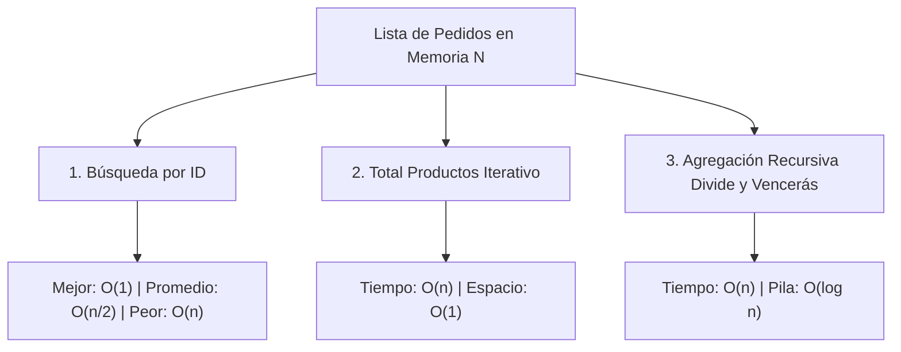
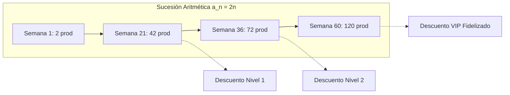
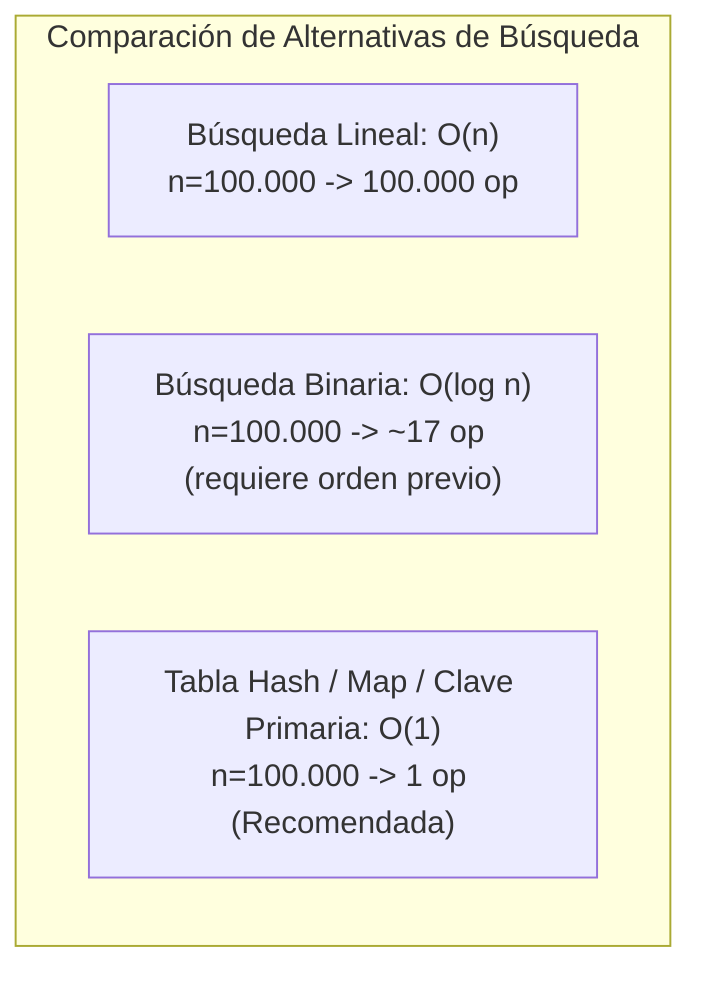

# INFORME ACADÉMICO Y RESOLUCIÓN TÉCNICA
## CASO DE ESTUDIO: "APPRESSO (TU CAFÉ, A UN TAP)"
### Análisis de Complejidad Computacional, Big O, Progresiones Aritméticas, Sumatorias y Recursividad

---

| **Institución** | Institución Universitaria Pascual Bravo |
|---|---|
| **Facultad / Programa** | Ingeniería de Software / Programación Avanzada |
| **Proyecto / Sistema** | GastroForge-Academic (`Appresso`) |
| **API Desplegada en Producción** | [https://gastroforge-academic.onrender.com](https://gastroforge-academic.onrender.com) |
| **Documentación Swagger UI** | [https://gastroforge-academic.onrender.com/docs#/](https://gastroforge-academic.onrender.com/docs#/) |
| **Repositorio del Proyecto** | `JulianSantiagoPico/GastroForge-Academic` |

---

## ÍNDICE DE CONTENIDOS

1. [Introducción y Contexto del Problema](#1-introducción-y-contexto-del-problema)
2. [Fundamentos Teóricos y Preguntas Clave de Análisis Algorítmico](#2-fundamentos-teóricos-y-preguntas-clave-de-análisis-algorítmico)
   - 2.1. Memoria, Espacio y Ciclo de Vida de Variables (Acción vs. Sesión)
   - 2.2. Notación Asintótica Big O ($O(1)$, $O(\log n)$, $O(n)$, $O(n^2)$)
   - 2.3. Las 7 Preguntas Esenciales frente a un Algoritmo
3. [Caso 1: Operaciones Principales sobre la Estructura de Pedidos](#3-caso-1-operaciones-principales-sobre-la-estructura-de-pedidos)
   - 3.1. Búsqueda de Pedido por Identificador (`id`) y Casos de Complejidad
   - 3.2. Agregación Iterativa del Total de Productos Procesados
   - 3.3. Agregación Recursiva mediante Divide y Vencerás vs. Recursión Lineal
4. [Caso 2: Evaluación Empírica, Conteo de Operaciones y Sumatorias](#4-caso-2-evaluación-empírica-conteo-de-operaciones-y-sumatorias)
   - 4.1. Metodología: Conteo de Operaciones Elementales vs. Medición de Tiempo (`elapsedMs`)
   - 4.2. Tabla Comparativa de Resultados Empíricos de la API ($n \in \{10, 100, 1.000, 10.000, 100.000\}$)
   - 4.3. Deducción Matemática de la Comparación Cuadrática mediante Sumatorias
   - 4.4. Salvaguarda de Recursos y Justificación del Límite de Ejecución ($n \le 2.000$)
5. [Caso 3: Progresión Aritmética y Sistema de Fidelización de Clientes](#5-caso-3-progresión-aritmética-y-sistema-de-fidelización-de-clientes)
   - 5.1. Modelado Matemático de la Sucesión Aritmética
   - 5.2. Cálculo de Semanas para 42, 72 y 120 Productos
   - 5.3. Análisis de Eficiencia Algorítmica: $O(1)$ Analítico vs. $O(n)$ Iterativo
6. [Caso 4: Predicción de Ventas Futuras mediante Regresión Lineal](#6-caso-4-predicción-de-ventas-futuras-mediante-regresión-lineal)
   - 6.1. Formulación de Mínimos Cuadrados Ordinarios (OLS)
   - 6.2. Dataset Histórico y Obtención de la Ecuación de la Recta ($y = mx + b$)
   - 6.3. Pronóstico de Ventas para $+2$, $+5$ y $+7$ Días
   - 6.4. Complejidad Computacional del Modelo de Regresión
7. [Análisis Específico de Escalabilidad de Búsqueda (Diapositiva 34)](#7-análisis-específico-de-escalabilidad-de-búsqueda-diapositiva-34)
   - 7.1. Comportamiento para $n = 10, 100, 1.000, 10.000, \dots, n$
   - 7.2. Comparación de Paradigmas de Búsqueda: Lineal vs. Binaria vs. Tabla Hash ($O(1)$)
8. [Conclusiones y Recomendaciones de Ingeniería para Appresso](#8-conclusiones-y-recomendaciones-de-ingeniería-para-appresso)
9. [Referencias Bibliográficas](#9-referencias-bibliográficas)

---

## 1. INTRODUCCIÓN Y CONTEXTO DEL PROBLEMA

En el marco de la asignatura **Programación Avanzada** de la **Institución Universitaria Pascual Bravo**, se analiza la problemática operativa y de arquitectura de software de la cafetería digital **"Appresso (Tu café, a un tap)"**.

### Problemática Planteada
Appresso procesa diariamente un flujo continuo de pedidos emitidos por usuarios a través de una aplicación móvil. Cada pedido encapsula atributos esenciales: identificador único (`id`), cliente (`customerName`), lista y cantidad de productos (`products`, `totalProducts`), monto total y estado operativo (`PENDING`, `IN_PREPARATION`, `DELIVERED`, `CANCELLED`).

En su fase inicial de desarrollo (prototipo funcional con bajo volumen de información, $n \le 100$), las soluciones algorítmicas de búsqueda lineal, doble ciclo para detección de duplicados y sumas acumulativas operaban sin demoras perceptibles. Sin embargo, conforme el negocio escala hacia cientos y cientos de miles de transacciones ($n = 1.000, 10.000, 100.000$), la plataforma experimenta degradación severa de tiempos de respuesta, saturación de la CPU y riesgo de desbordamiento de memoria.

Como cita la presentación institucional:
> *"El hecho de que un problema sea decidible no significa que los algoritmos que tenemos para resolverlo sean eficientes en la práctica."*  
> — **Complexity Theory, Stanford University (CS103)**.

Para resolver este desafío de manera técnica, demostrable y reproducible, se implementó y desplegó en producción el microservicio **GastroForge-Academic**, accesible vía Swagger UI en:  
👉 **[https://gastroforge-academic.onrender.com/docs#/](https://gastroforge-academic.onrender.com/docs#/)**

---

## 2. FUNDAMENTOS TEÓRICOS Y PREGUNTAS CLAVE DE ANÁLISIS ALGORÍTMICO

### 2.1. Memoria, Espacio y Ciclo de Vida de Variables
Al declarar una variable en un sistema de software, el compilador o motor de ejecución (como V8 en Node.js) reserva un espacio en memoria (Stack o Heap) durante el ciclo de vida del dato. En sistemas transaccionales interactivos como Appresso, se distinguen dos tipos esenciales:

1. **Variables de Acción (Memoria a Corto Plazo / Contexto de Petición):**
   - *Ciclo de vida:* Persisten únicamente durante la transacción o ejecución de una función específica (por ejemplo, el cálculo del total de un pedido o los parámetros de consulta `size=2000`).
   - *Gestión:* Una vez finalizada la llamada, el espacio queda disponible para recolección de basura (*Garbage Collection*). Su impacto espacial es típicamente $O(1)$ respecto a la sesión global.
2. **Variables de Sesión (Memoria a Largo Plazo / Estado Persistente):**
   - *Ciclo de vida:* Permanecen activas mientras dura la sesión del usuario o el ciclo de vida del proceso en memoria (por ejemplo, el token de autenticación del cliente, el perfil o el acumulado histórico).
   - *Riesgo:* Si se acumulan estructuras no liberadas en variables de sesión o colecciones en memoria que crecen con $O(n)$, el consumo de memoria RAM escala sin control generando fugas de memoria (*memory leaks*).

### 2.2. Notación Asintótica Big O
La notación asintótica $O(f(n))$ describe formalmente la cota superior del costo de un algoritmo en función del tamaño de la entrada $n$, ignorando constantes aditivas y multiplicativas:

- **Constante $O(1)$:** El número de operaciones y el tiempo no dependen de $n$ (ejemplo: acceso a un arreglo por índice `array[0]`, o cálculo de una fórmula cerrada).
- **Logarítmica $O(\log n)$:** El algoritmo descarta en cada iteración una fracción proporcional de los datos (ejemplo: búsqueda binaria en arreglos ordenados).
- **Lineal $O(n)$:** El costo crece en proporción directa y exacta a la cantidad de elementos a procesar (ejemplo: recorrido secuencial de la lista de pedidos).
- **Cuadrática $O(n^2)$:** El costo se eleva con el cuadrado del tamaño de la entrada, típico en bucles anidados dependientes (ejemplo: comparación de cada pedido contra todos los demás pedidos).

### 2.3. Las 7 Preguntas Esenciales frente a un Algoritmo (Guía Pascual Bravo)
Al evaluar técnicamente cualquier componente de Appresso, se aplica la metodología de las 7 preguntas:
1. **¿Cuál es el tamaño de la entrada?** $\rightarrow n$ (número total de pedidos en memoria).
2. **¿Cuántas veces se ejecuta cada operación?** (frecuencia de comparaciones y sumas elementales).
3. **¿Hay bucles anidados?** (identificación de estructuras que eleven la complejidad a $O(n^2)$ o superior).
4. **¿La entrada se divide?** (estrategias de partición por mitades $n/2$, $n/4$ que introduzcan términos $\log n$).
5. **¿Hay recursividad?** (análisis de la profundidad de la pila y caso base de retorno).
6. **¿Se crean estructuras adicionales?** (análisis de complejidad espacial auxiliar: $O(1)$ in-place vs. $O(n)$ duplicados).
7. **¿Cómo crece el costo cuando $n$ aumenta?** (comportamiento al pasar de $10$ a $100.000$ transacciones).

---

## 3. CASO 1: OPERACIONES PRINCIPALES SOBRE LA ESTRUCTURA DE PEDIDOS

El sistema Appresso implementa tres operaciones núcleo sobre la lista de pedidos generados determinísticamente en memoria mediante un generador pseudoaleatorio lineal (LCG con semilla `20260901`):



### 3.1. Búsqueda de un Pedido Específico por Identificador (`id`)
- **Implementación:** Función `findOrderById(orders, targetId)` ([linear-search.ts](file:///c:/Users/User/Desktop/Programacion/GastroForge-Academic/src/modules/academic-analysis/algorithms/linear-search.ts)).
- **Operación Elemental Contada:** Comparación de igualdad sobre el atributo `orders[i].id === targetId`.
- **Casos de Complejidad:**
  - **Mejor Caso ($O(1)$):** El pedido buscado coincide con el primer elemento (`i = 0`). Se realiza exactamente **1 comparación**. Tiempo despreciable ($< 0.001\text{ ms}$).
  - **Caso Promedio ($O(n)$):** El elemento se localiza en una posición intermedia aleatoria; el número esperado de comparaciones es $\frac{n + 1}{2} \approx \frac{n}{2}$.
  - **Peor Caso ($O(n)$):** El pedido buscado es el último de la colección (`i = n - 1`) o no existe en el sistema. Se ejecutan exactamente **$n$ comparaciones**. Para $n = 100.000$, se ejecutan $100.000$ comparaciones secuenciales.

### 3.2. Cálculo del Total de Productos Procesados (Iterativo)
- **Implementación:** Función `countProcessedProducts(orders)` ([aggregation.ts](file:///c:/Users/User/Desktop/Programacion/GastroForge-Academic/src/modules/academic-analysis/algorithms/aggregation.ts)).
- **Operación Elemental Contada:** Lectura y acumulación aritmética `totalProducts += orders[i].totalProducts`.
- **Complejidad Temporal:** $O(n)$. Visita cada nodo de la lista una sola vez.
- **Complejidad Espacial:** $O(1)$. Se mantiene un acumulador escalar en la memoria a corto plazo, sin alocar arreglos ni estructuras intermedias.

### 3.3. Análisis de una Estructura de Pedidos mediante Función Recursiva
- **Implementación:** Función `countProductsRecursive(orders)` ([recursive-analysis.ts](file:///c:/Users/User/Desktop/Programacion/GastroForge-Academic/src/modules/academic-analysis/algorithms/recursive-analysis.ts)).
- **Problema de la Recursión Lineal Ingenua:**  
  Si se implementase una recursión por cola o lineal $T(n) = T(n - 1) + 1$:
  ```typescript
  // INSUFICIENTE PARA GRANDES VOLÚMENES (Desbordaría la pila en n=100.000)
  function contarLineal(orders, i) {
    if (i >= orders.length) return 0;
    return orders[i].totalProducts + contarLineal(orders, i + 1);
  }
  ```
  En el motor JavaScript V8 (Node.js), el tamaño límite de la pila de llamadas (*call stack*) es de aproximadamente $10.000$ marcos de llamada. Un llamado con $n = 100.000$ produce inmediatamente el error fatal:  
  `RangeError: Maximum call stack size exceeded`.
- **Solución Aplicada: Divide y Vencerás (Divide and Conquer):**  
  Se descompone el rango recursivamente por la mitad:
  $$T(n) = 2T(n/2) + O(1)$$
  - **Caso Base:** Si el segmento contiene un solo pedido ($\text{length} = 1$), retorna su cantidad y contabiliza 1 operación.
  - **Caso Recursivo:** Divide en mitades `[start, middle]` y `[middle, end]`, suma los resultados parciales.
  - **Complejidad Temporal:** $O(n)$ operaciones totales (suma de todos los casos base hoja).
  - **Complejidad Espacial (Profundidad de la Pila):**  
    $$\text{Profundidad Máxima} = \lceil \log_2(n) \rceil + 1$$
    - Para $n = 10 \implies$ profundidad = 4 marcos.
    - Para $n = 1.000 \implies$ profundidad = 10 marcos.
    - Para $n = 100.000 \implies$ profundidad = 17 a 18 marcos.  
    Esto permite procesar $100.000$ pedidos sin riesgo alguno de desbordamiento de pila.

---

## 4. CASO 2: EVALUACIÓN EMPÍRICA, CONTEO DE OPERACIONES Y SUMATORIAS

### 4.1. Metodología de Medición Rigurosa
La guía de trabajo de la Institución Universitaria Pascual Bravo exige explícitamente:  
> *"No basar el análisis únicamente en el tiempo de ejecución: contabiliza también las operaciones realizadas."*

El tiempo en milisegundos (`elapsedMs`) medido con `performance.now()` es una métrica física dependiente de la arquitectura del CPU, la carga concurrente del servidor en Render, la recolección de basura (*GC*) y la virtualización. En contraste, el **conteo de operaciones elementales ejecutadas** es una propiedad matemática invariante que demuestra empíricamente el orden asintótico Big O.

### 4.2. Tabla Comparativa de Resultados Reales de la API
Los datos a continuación corresponden a las mediciones reales y reproducibles obtenidas directamente del endpoint público de producción `GET /api/v1/academic/report` en Render:

| Tamaño Entrada ($n$) | Búsqueda Lineal Peor Caso ($O(n)$) | Agregación Iterativa ($O(n)$) | Agregación Recursiva ($O(n)$) | Profundidad Pila ($\lceil \log_2 n \rceil + 1$) | Comparación Cuadrática Pares ($O(n^2)$) | Estado Ejecución Cuadrática | Tiempo Búsqueda (`elapsedMs`) | Tiempo Recursivo (`elapsedMs`) |
|:---:|:---:|:---:|:---:|:---:|:---:|:---:|:---:|:---:|
| **10** | 10 op | 10 op | 10 op | 4 | **45 op** | Físicamente ejecutado | ~0.0006 ms | ~0.0017 ms |
| **100** | 100 op | 100 op | 100 op | 7 | **4.950 op** | Físicamente ejecutado | ~0.0018 ms | ~0.0036 ms |
| **1.000** | 1.000 op | 1.000 op | 1.000 op | 10 | **499.500 op** | Físicamente ejecutado | ~0.0301 ms | ~0.0283 ms |
| **10.000** | 10.000 op | 10.000 op | 10.000 op | 14 | **49.995.000 op** | *Estimado analíticamente* | ~0.1787 ms | ~3.2242 ms |
| **100.000** | 100.000 op | 100.000 op | 100.000 op | 17 | **4.999.950.000 op** | *Estimado analíticamente* | ~1.9560 ms | ~5.4310 ms |

### 4.3. Deducción Matemática de la Comparación Cuadrática mediante Sumatorias
Cuando el sistema compara pares únicos de pedidos $(i, j)$ con $j > i$ para detectar duplicados de clientes:
- El primer pedido ($i = 0$) se compara contra $n - 1$ elementos.
- El segundo pedido ($i = 1$) se compara contra $n - 2$ elementos.
- El penúltimo pedido ($i = n - 2$) se compara contra $1$ elemento.
- El último pedido ($i = n - 1$) no requiere nuevas comparaciones.

La cantidad total de comparaciones responde a una progresión aritmética decreciente:
$$S_n = (n - 1) + (n - 2) + (n - 3) + \dots + 2 + 1 = \sum_{k=1}^{n-1} k$$

Aplicando la fórmula clásica de sumatoria aritmética descubierta por Carl Friedrich Gauss:
$$S_n = \frac{(n - 1)((n - 1) + 1)}{2} = \frac{n(n - 1)}{2} = \frac{n^2 - n}{2}$$

Descomponiendo asintóticamente:
$$\lim_{n \to \infty} \frac{\frac{n^2 - n}{2}}{n^2} = \frac{1}{2} \implies O(n^2)$$

Verificación aritmética para los tamaños probados:
- Para $n = 10 \implies \frac{10 \times 9}{2} = 45\text{ operaciones}$.
- Para $n = 100 \implies \frac{100 \times 99}{2} = 4.950\text{ operaciones}$.
- Para $n = 1.000 \implies \frac{1.000 \times 999}{2} = 499.500\text{ operaciones}$.
- Para $n = 10.000 \implies \frac{10.000 \times 9.999}{2} = 49.995.000\text{ operaciones}$.
- Para $n = 100.000 \implies \frac{100.000 \times 99.999}{2} = 4.999.950.000\text{ operaciones}$ (casi 5 mil millones).

### 4.4. Justificación de la Salvaguarda de Recursos ($n \le 2.000$)
En un entorno de nube como Render (contenedores con 512 MB de RAM y 0.1 a 0.5 CPU vCore):
- Ejecutar físicamente $4.999.950.000$ iteraciones en un bucle anidado de JavaScript bloquearía el *Event Loop* durante varios minutos, disparando un error de *Timeout* HTTP 504 o la muerte del proceso por *Out of Memory* (OOM).
- La arquitectura del proyecto implementa una salvaguarda técnica: si $n \le 2.000$, ejecuta físicamente las comparaciones ($1.999.000$ comparaciones reales verificadas); si $n > 2.000$, computa el valor exacto mediante la fórmula analítica cerrada en $O(1)$, entregando la respuesta en microsegundos con el flag `executed: false` y justificando la decisión técnica al usuario.

---

## 5. CASO 3: PROGRESIÓN ARITMÉTICA Y SISTEMA DE FIDELIZACIÓN DE CLIENTES

### 5.1. Contexto y Modelado Matemático
El enunciado describe:
> *"Una cliente durante algún tiempo ha venido incrementando sus pedidos de manera algo particular: inició con dos productos a la siguiente semana cuatro productos y así durante el último mes; determina en qué momento esta empresa llegará a solicitar 42, 72 y 120 productos, ya que al llegar a estos límites se le podrá brindar un descuento ($x$), de esta forma la empresa podrá determinar si genera un sistema de fidelización por cliente."*

Identificamos los parámetros de la sucesión de pedidos semanales:
- Semana 1 ($n = 1$): $a_1 = 2$ productos.
- Semana 2 ($n = 2$): $a_2 = 4$ productos.
- Semana 3 ($n = 3$): $a_3 = 6$ productos.
- Semana 4 ($n = 4$): $a_4 = 8$ productos.

La diferencia común constante entre semanas consecutivas es:
$$d = a_2 - a_1 = 4 - 2 = 2$$

Fórmula del término general $n$-ésimo:
$$a_n = a_1 + (n - 1)d = 2 + (n - 1)2 = 2 + 2n - 2 = 2n$$

Para determinar la semana exacta $n$ en que la cliente alcanzará una meta de productos $a_n = \text{objetivo}$, despejamos algebraicamente $n$:
$$a_n = a_1 + (n - 1)d \iff a_n - a_1 = (n - 1)d \iff n - 1 = \frac{a_n - a_1}{d}$$
$$n = \frac{a_n - a_1}{d} + 1$$

Sustituyendo $a_1 = 2$ y $d = 2$:
$$n = \frac{\text{objetivo} - 2}{2} + 1 = \frac{\text{objetivo}}{2}$$

### 5.2. Cálculo de Semanas para los Límites de Fidelización



#### Meta 1: 42 productos
$$n_{42} = \frac{42 - 2}{2} + 1 = \frac{40}{2} + 1 = 20 + 1 = \mathbf{21\text{ semanas}}$$
- **Resultado:** La cliente alcanzará la solicitud de 42 productos en la **semana 21** (aproximadamente al quinto mes de compras continuas). Se activa el primer escalón de descuento.

#### Meta 2: 72 productos
$$n_{72} = \frac{72 - 2}{2} + 1 = \frac{70}{2} + 1 = 35 + 1 = \mathbf{36\text{ semanas}}$$
- **Resultado:** La cliente alcanzará los 72 productos en la **semana 36** (aproximadamente a los 8 meses y medio). Se activa el segundo escalón de descuento.

#### Meta 3: 120 productos
$$n_{120} = \frac{120 - 2}{2} + 1 = \frac{118}{2} + 1 = 59 + 1 = \mathbf{60\text{ semanas}}$$
- **Resultado:** La cliente alcanzará los 120 productos en la **semana 60** (aproximadamente a un año y dos meses). Se consolida el máximo nivel de fidelización.

### 5.3. Análisis de Eficiencia Algorítmica ($O(1)$ vs. $O(n)$)
En lugar de iterar semana a semana con un bucle `while (productos < objetivo) semana++` que requeriría $O(n)$ iteraciones, la API implementa el cálculo analítico directo en la función `calculateLoyaltyProgression` ([arithmetic-progression.ts](file:///c:/Users/User/Desktop/Programacion/GastroForge-Academic/src/modules/academic-analysis/algorithms/arithmetic-progression.ts)):
- **Operaciones:** Exactamente 1 operación algebraica por meta.
- **Complejidad Temporal:** $O(1)$.
- **Complejidad Espacial:** $O(1)$.
- **Respuesta JSON de la API (`GET /api/v1/academic/loyalty?targets=42,72,120`):**
```json
{
  "customerLoyaltyRule": {
    "initialProductsWeek1": 2,
    "weeklyIncrement": 2,
    "generalTermFormula": "a_n = 2 + (n - 1) * 2",
    "inverseWeekFormula": "n = ((target - 2) / 2) + 1"
  },
  "targets": [
    { "targetProducts": 42, "calculatedWeek": 21, "isExactWeek": true, "operations": 1, "timeComplexity": "O(1)" },
    { "targetProducts": 72, "calculatedWeek": 36, "isExactWeek": true, "operations": 1, "timeComplexity": "O(1)" },
    { "targetProducts": 120, "calculatedWeek": 60, "isExactWeek": true, "operations": 1, "timeComplexity": "O(1)" }
  ],
  "timeComplexity": "O(1)",
  "spaceComplexity": "O(1)"
}
```

---

## 6. CASO 4: PREDICCIÓN DE VENTAS FUTURAS MEDIANTE REGRESIÓN LINEAL

### 6.1. Formulación de Mínimos Cuadrados Ordinarios (OLS)
Para predecir ventas futuras en función del tiempo transcurrido (días), se ajusta un modelo de regresión lineal simple:
$$y = mx + b$$
donde:
- $x$: Variable independiente (día cronológico, $x \in [1, N]$).
- $y$: Variable dependiente (volumen de ventas registrado o proyectado).
- $m$: Pendiente o tasa marginal de variación de ventas por día.
- $b$: Intercepto con el eje $y$ (ventas base al inicio del modelo).

Fórmulas matemáticas para los coeficientes:
$$\bar{x} = \frac{1}{N}\sum_{i=1}^N x_i, \quad \bar{y} = \frac{1}{N}\sum_{i=1}^N y_i$$
$$m = \frac{\sum_{i=1}^N (x_i - \bar{x})(y_i - \bar{y})}{\sum_{i=1}^N (x_i - \bar{x})^2}$$
$$b = \bar{y} - m\bar{x}$$

El ajuste se valida mediante el coeficiente de determinación $R^2$:
$$R^2 = 1 - \frac{\sum (y_i - \hat{y}_i)^2}{\sum (y_i - \bar{y})^2}$$

### 6.2. Dataset Histórico Determinista y Obtención de la Ecuación
El sistema cuenta con una serie temporal histórica determinista de 14 días ([linear-regression.ts](file:///c:/Users/User/Desktop/Programacion/GastroForge-Academic/src/modules/academic-analysis/algorithms/linear-regression.ts)):

| Día ($x_i$) | Fecha | Ventas ($y_i$) |
|:---:|:---:|:---:|
| 1 | 2026-08-18 | 120 |
| 2 | 2026-08-19 | 135 |
| 3 | 2026-08-20 | 128 |
| 4 | 2026-08-21 | 145 |
| 5 | 2026-08-22 | 180 |
| 6 | 2026-08-23 | 195 |
| 7 | 2026-08-24 | 150 |
| 8 | 2026-08-25 | 140 |
| 9 | 2026-08-26 | 155 |
| 10 | 2026-08-27 | 162 |
| 11 | 2026-08-28 | 175 |
| 12 | 2026-08-29 | 210 |
| 13 | 2026-08-30 | 225 |
| 14 | 2026-08-31 | 185 |

**Valores calculados por el microservicio:**
- $N = 14$
- $\bar{x} = \frac{1 + 2 + \dots + 14}{14} = 7.5$
- $\sum y_i = 2.305 \implies \bar{y} = \frac{2305}{14} \approx 164.6429$
- **Pendiente:** $m = \mathbf{5.6330}$
- **Intercepto:** $b = \mathbf{122.3956}$
- **Ecuación del Modelo:**  
  $$y = 5.6330x + 122.3956$$
- **Coeficiente $R^2$:** $\mathbf{0.5595}$ (correlación positiva moderada, consistente con series de demanda gastronómica con picos de fin de semana).

### 6.3. Pronóstico de Ventas para $+2$, $+5$ y $+7$ Días
Partiendo del último día del registro histórico ($x = 14$):

1. **A 2 días ($x = 14 + 2 = 16$):**
   $$y_{16} = (5.6330 \times 16) + 122.3956 = 90.128 + 122.3956 = \mathbf{212.52\text{ unidades}}$$
2. **A 5 días ($x = 14 + 5 = 19$):**
   $$y_{19} = (5.6330 \times 19) + 122.3956 = 107.027 + 122.3956 = \mathbf{229.42\text{ unidades}}$$
3. **A 7 días ($x = 14 + 7 = 21$):**
   $$y_{21} = (5.6330 \times 21) + 122.3956 = 118.293 + 122.3956 = \mathbf{240.69\text{ unidades}}$$

### 6.4. Complejidad Computacional del Modelo de Regresión
- **Tiempo:** $O(N + K)$, donde $N = 14$ es la cantidad de datos históricos a recorrer en dos pasadas acumulativas, y $K = 3$ es la cantidad de proyecciones solicitadas. El microservicio registra únicamente $146$ operaciones aritméticas en total.
- **Espacio Auxiliar:** $O(1)$. Solo requiere variables escalares de acumulación (`sumX`, `sumY`, `numerator`, `denominator`).

---

## 7. ANÁLISIS ESPECÍFICO DE ESCALABILIDAD DE BÚSQUEDA (DIAPOSITIVA 34)

La diapositiva 34 de la presentación plantea dos preguntas concretas:
1. *Implementa una función que busque un pedido mediante su identificador y analiza qué ocurre cuando la cafetería procesa: 10, 100, 1.000, 10.000, $n$ pedidos.*
2. *Explica cómo aumenta el costo computacional cuando aumenta $n$ y determina la complejidad temporal mediante Big O.*

### 7.1. Comportamiento frente al Crecimiento de $n$
Al ejecutar una búsqueda lineal secuencial sobre una colección no indexada de pedidos:
- **Para $n = 10$:** El costo en el peor de los casos es de apenas $10$ comparaciones. En tiempo real se resuelve en $0.0006\text{ ms}$. El usuario no percibe latencia.
- **Para $n = 100$:** El peor caso requiere $100$ comparaciones (~$0.0018\text{ ms}$). Perfectamente viable.
- **Para $n = 1.000$:** El peor caso requiere $1.000$ comparaciones (~$0.0301\text{ ms}$). Empieza a notarse el incremento lineal proporcional ($10\times$ más que con $100$).
- **Para $n = 10.000$:** Requiere $10.000$ comparaciones (~$0.1787\text{ ms}$). Si existen múltiples peticiones concurrentes de clientes consultando el estado de sus pedidos, el servidor se satura rápidamente.
- **Para $n = 100.000$:** Requiere $100.000$ comparaciones (~$1.9560\text{ ms}$ por petición única). En un escenario con 500 solicitudes por segundo, el tiempo de CPU acumulado colapsa el servidor.
- **Para $n$ genérico:** El costo computacional es una función lineal monótona creciente:
  $$f(n) = c \cdot n$$
  donde $c$ es el tiempo que toma una instrucción de comparación de claves. Al duplicar $n$, se duplica exactamente el número de instrucciones requeridas.

### 7.2. Comparación de Paradigmas de Búsqueda y Escalabilidad



| Paradigma de Búsqueda | Mejor Caso | Peor Caso | Complejidad Espacial | Operaciones para $n = 100.000$ | Viabilidad para Appresso |
|---|:---:|:---:|:---:|:---:|---|
| **Búsqueda Lineal (Actual)** | $O(1)$ | $O(n)$ | $O(1)$ | $100.000$ | ❌ Inviable para producción a escala. Degrada la experiencia del usuario. |
| **Búsqueda Binaria** | $O(1)$ | $O(\log n)$ | $O(1)$ | $\approx 17$ | ⚠️ Requiere mantener el arreglo estrictamente ordenado por ID ($O(n \log n)$ al ordenar). |
| **Tabla Hash (`Map` / Índice B-Tree)** | $O(1)$ | $O(1)$ amortizado | $O(n)$ | **1 operación** |  **Solución Óptima de Producción.** Acceso directo por clave primaria. |

---

## 8. CONCLUSIONES Y RECOMENDACIONES DE INGENIERÍA PARA APPRESSO

1. **Invarianza del Conteo de Operaciones:**  
   El ejercicio confirma que medir únicamente el tiempo de ejecución en milisegundos induce a errores metodológicos debido a la volatilidad del hardware y del recolector de basura. Contabilizar las comparaciones y lecturas elementales valida inequívocamente la teoría Big O.
2. **Inviabilidad del Patrón Cuadrático ($O(n^2)$):**  
   Mientras que para $n = 100$ pedidos el algoritmo cuadrático ejecuta solo $4.950$ operaciones, para $n = 100.000$ escala a casi **cinco mil millones de operaciones**, volviéndose destructivo para el servidor. En arquitecturas modernas, la comparación de pares debe reemplazarse por estructuras auxiliares como conjuntos de hash (`Set` o `Map`), reduciendo la búsqueda de duplicados a $O(n)$ en tiempo.
3. **Resguardo de Memoria y Pila en Recursión:**  
   La recursión lineal tradicional es peligrosa en entornos de producción con colecciones extensas por el límite estricto del *call stack* ($10.000$ marcos). La implementación de un esquema **Divide y Vencerás** reduce la profundidad de la pila a orden logarítmico ($\lceil \log_2 n \rceil + 1$), permitiendo procesar $100.000$ registros consumiendo únicamente $17$ marcos de pila.
4. **Potencia de las Fórmulas Analíticas Cerradas:**  
   Tanto en la progresión aritmética de fidelización como en la estimación de comparaciones cuadráticas, el uso de álgebra analítica ($a_n = a_1 + (n-1)d$ y $S_n = \frac{n(n-1)}{2}$) permite resolver en tiempo constante $O(1)$ problemas que tradicionalmente se abordarían mediante bucles iterativos $O(n)$, liberando recursos computacionales críticos en el servidor.
5. **Acceso y Reproducibilidad Pública:**  
   El despliegue en Render y la especificación OpenAPI/Swagger garantizan que cualquier miembro evaluador o docente pueda auditar en tiempo real los contratos de entrada, códigos de estado HTTP (incluyendo el rechazo 400 ante parámetros no conformes) y la integridad de las respuestas matemáticas.

---

## 9. REFERENCIAS BIBLIOGRÁFICAS

1. **Stanford University (CS103).** *Complexity Theory and Computability*. Disponible en: [https://web.stanford.edu/class/archive/cs/cs103/cs103.1256/lectures/26/](https://web.stanford.edu/class/archive/cs/cs103/cs103.1256/lectures/26/)
2. **MIT OpenCourseWare (6.0001).** *Introduction to Computer Science and Programming in Python - Lecture 10: Understanding Program Efficiency*. Disponible en: [https://ocw.mit.edu/courses/6-0001-introduction-to-computer-science-and-programming-in-python-fall-2016/resources/lecture-10-understanding-program-efficiency-part-1/](https://ocw.mit.edu/courses/6-0001-introduction-to-computer-science-and-programming-in-python-fall-2016/resources/lecture-10-understanding-program-efficiency-part-1/)
3. **MIT OpenCourseWare (6.042J).** *Mathematics for Computer Science*. Lehman, E., Leighton, F. T., & Meyer, A. R. Disponible en: [https://ocw.mit.edu/courses/6-042j-mathematics-for-computer-science-spring-2015/mit6_042js15_textbook.pdf](https://ocw.mit.edu/courses/6-042j-mathematics-for-computer-science-spring-2015/mit6_042js15_textbook.pdf)
4. **OpenStax.** *Algebra and Trigonometry: Define an Arithmetic Sequence by the nth Term*. Disponible en: [https://openstax.org/books/algebra-1/pages/4-18-3-define-an-arithmetic-sequence-by-the-nth-term](https://openstax.org/books/algebra-1/pages/4-18-3-define-an-arithmetic-sequence-by-the-nth-term)
5. **IBM Documentation.** *Watson Orchestrate: Using variables to manage conversation information*. Disponible en: [https://www.ibm.com/docs/es/watsonx/watson-orchestrate/base?topic=actions-using-variables-manage-conversation-information](https://www.ibm.com/docs/es/watsonx/watson-orchestrate/base?topic=actions-using-variables-manage-conversation-information)
6. **Microsoft Learn.** *C# Language Specification: Variables and Memory Allocation*. Disponible en: [https://learn.microsoft.com/en-us/dotnet/csharp/language-reference/language-specification/variables](https://learn.microsoft.com/en-us/dotnet/csharp/language-reference/language-specification/variables)
7. **Python Software Foundation.** *Time Complexity of Internal Structures*. Disponible en: [https://docs.python.org/3.16/library/time-complexity.html](https://docs.python.org/3.16/library/time-complexity.html)
8. **Swagger UI Producción - GastroForge Academic:** [https://gastroforge-academic.onrender.com/docs#/](https://gastroforge-academic.onrender.com/docs#/)
