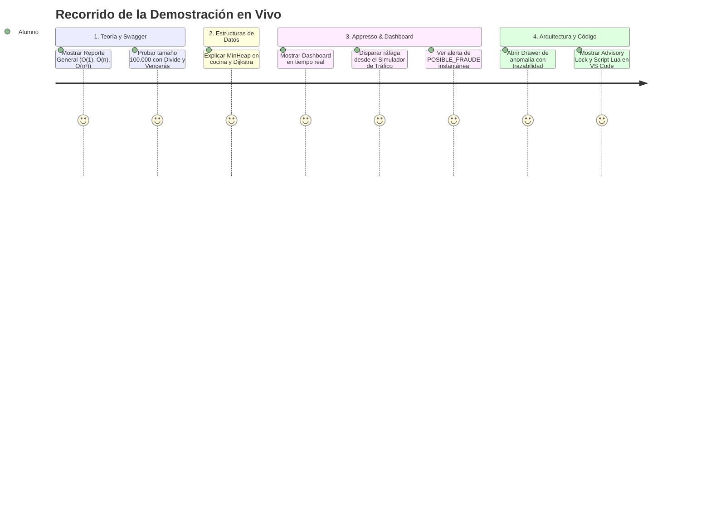

# GUÍA DE SUSTENTACIÓN Y DEFENSA TÉCNICA
## Proyecto Integrador GastroForge-Academic & Appresso
### Manual Estratégico para el Equipo de Desarrollo: "Entender y Explicar lo que Hicimos"

---

> 💡 **OBJETIVO DE ESTA GUÍA:**  
> Este documento está diseñado para que cualquier integrante del equipo domine conceptual y técnicamente cada rincón del proyecto. Úsalo para preparar la sustentación oral, responder preguntas difíciles del docente y realizar una demostración en vivo impecable sin titubear.

---

## ÍNDICE RÁPIDO

1. [El "Elevator Pitch" (Explicación de 60 Segundos)](#1-el-elevator-pitch-explicación-de-60-segundos)
2. [Mapa Mental del Código: ¿Dónde Abrir Cada Cosa?](#2-mapa-mental-del-código-dónde-abrir-cada-cosa)
3. [Las 10 Preguntas Clave del Docente y Cómo Defenderlas](#3-las-10-preguntas-clave-del-docente-y-cómo-defenderlas)
4. [Guión de Demostración en Vivo (Demo Paso a Paso de 7 Minutos)](#4-guión-de-demostración-en-vivo-demo-paso-a-paso-de-7-minutos)
5. [Preguntas de Emboscada (Deep Dive Técnico)](#5-preguntas-de-emboscada-deep-dive-técnico)
6. [Glosario Rápido de Términos Clave](#6-glosario-rápido-de-términos-clave)

---

## 1. EL "ELEVATOR PITCH" (EXPLICACIÓN DE 60 SEGUNDOS)

> *"Profesor, nuestro proyecto no es una simple API con ejercicios aislados: es la evolución completa desde la **teoría asintótica matemática** hasta una **arquitectura transaccional distribuida y resiliente**.*  
> 
> *Iniciamos en la **Unidad 1 y 2** demostrando con conteo exacto de operaciones elementales por qué los algoritmos cuadráticos $O(n^2)$ y la recursión lineal colapsan en memoria, implementando estructuras optimizadas como MinHeaps y Divide y Vencerás.*  
> 
> *Luego, llevamos esa teoría al caso real de **Appresso**, un sistema de pedidos y pagos expuesto a tráfico concurrente de bots. Implementamos una **ventana deslizante temporal** en tiempo amortizado $O(1)$, exclusión mutua distribuida con **Advisory Locks** en PostgreSQL para evitar condiciones de carrera, aceleración con **Redis y Scripts Lua atómicos**, un **Circuit Breaker** para degradación suave ante fallos, y un **Dashboard reactivo** con métricas de estabilidad visual estrictas (CLS = 0).*  
> 
> *Todo el sistema está verificado con 102 pruebas automatizadas al 100% y métricas reales de SLO en producción."*

---

## 2. MAPA MENTAL DEL CÓDIGO: ¿DÓNDE ABRIR CADA COSA?

Si el docente pide: *"Muéstrenme el código donde hicieron X"*, abran de inmediato estos archivos clave:

```text
GastroForge-Academic/
├── backend/src/
│   ├── modules/
│   │   ├── academic-analysis/algorithms/
│   │   │   ├── order-generator.ts        👉 Generador LCG determinista (semilla 20260901)
│   │   │   ├── linear-search.ts          👉 Búsqueda secuencial O(n) vs mejor caso O(1)
│   │   │   ├── recursive-analysis.ts     👉 Divide y Vencerás O(log n) pila para 100.000 items
│   │   │   ├── quadratic-analysis.ts     👉 Gauss n(n-1)/2 y salvaguarda (size <= 2000)
│   │   │   ├── arithmetic-progression.ts 👉 Progresión aritmética de fidelización en O(1)
│   │   │   └── linear-regression.ts      👉 Regresión lineal OLS y predicción de ventas
│   │   │
│   │   ├── structures/data-structures/
│   │   │   ├── queue.ts                  👉 Cola FIFO con LinkedList O(1) (no Array.shift)
│   │   │   ├── min-heap.ts               👉 MinHeap O(log n) para prioridad de pedidos en cocina
│   │   │   ├── stack.ts                  👉 Doble Pila O(1) para Undo/Redo en comandas
│   │   │   └── weighted-graph.ts         👉 Dijkstra O((V+E)log V) con MinHeap para mozos
│   │   │
│   │   └── appresso/
│   │       ├── fraud-detection/
│   │       │   ├── sliding-window.ts     👉 Ventana deslizante pura (now - W, borde inclusivo)
│   │       │   └── time-band-policy.ts   👉 Umbrales por franjas horarias UTC (10, 6, 3)
│   │       ├── crypto/hmac.ts            👉 Canonicalización deep-sort y timingSafeEqual
│   │       ├── persistence/
│   │       │   └── advisory-lock.ts      👉 pg_advisory_xact_lock(hash(userId)) en PostgreSQL
│   │       ├── redis/
│   │       │   └── redis-sliding-window.adapter.ts 👉 Script Lua atómico y Circuit Breaker
│   │       ├── analytics/analytics.service.ts      👉 Read model con agregaciones nativas SQL
│   │       └── throttling/
│   │           └── appresso-reject-origin.interceptor.ts 👉 Separa Throttler de Fraude
│   │
├── frontend/src/
│   ├── components/
│   │   ├── MetricCards.tsx               👉 Tarjetas analíticas con memoización y Skeletons
│   │   ├── TimeseriesChart.tsx           👉 Gráfico Recharts con contenedor fijo (CLS = 0)
│   │   ├── EpisodesTable.tsx             👉 Tabla con Lucide-React y badges de severidad
│   │   ├── TimelineDrawer.tsx            👉 Drawer lateral accesible slide-over
│   │   └── TrafficSimulator.tsx          👉 Playground de ráfagas con firma segura en backend
```

---

## 3. LAS 10 PREGUNTAS CLAVE DEL DOCENTE Y CÓMO DEFENDERLAS

### Pregunta 1: "¿Por qué en la Unidad 1 usaron datos en memoria y luego en Appresso metieron PostgreSQL?"
- **Respuesta Corta:** Porque sus objetivos son distintos: la Unidad 1 mide **complejidad asintótica pura** y requería aislamiento de I/O de disco; Appresso es un sistema transaccional de pagos que exige **durabilidad, persistencia entre réplicas e idempotencia real**.
- **Profundización Técnica:** En la Unidad 1, meter una base de datos habría introducido ruido incontrolable (latencia de red, buffer pool de PostgreSQL, I/O en disco), impidiendo verificar matemáticamente si un algoritmo era $O(n)$ o $O(n^2)$. En Appresso, un ataque de bots no puede depender de la memoria RAM del contenedor: si el pod se reinicia, un bot volvería a gastar sin control y los duplicados no se detectarían. Por eso se implementó PostgreSQL en Neon con un fallback in-memory automático para desarrollo y tests.
- **Trampa a evitar:** No digas *"nos dio pereza conectar la base de datos al inicio"*. Demuestra que fue una decisión arquitectónica premeditada y registrada en [`docs/decisiones.md`](file:///c:/Users/User/Desktop/Programacion/GastroForge-Academic/docs/decisiones.md).

---

### Pregunta 2: "¿Cómo midieron el Big O matemáticamente si el tiempo en milisegundos varía?"
- **Respuesta Corta:** Mediante **conteo explícito de operaciones elementales ejecutadas**, que es determinista e invariante a la máquina, usando `performance.now()` solo como métrica física complementaria.
- **Profundización Técnica:** En plataformas cloud como Render, los milisegundos (`elapsedMs`) fluctúan por la carga de CPU compartida y el recolector de basura (*Garbage Collector*) de Node.js V8. En cambio, si contamos las comparaciones reales (`orders[i].id === targetId`), para $n = 1.000$ en el peor caso siempre se ejecutan exactamente $1.000$ comparaciones lineales y $499.500$ comparaciones cuadráticas, tanto en local como en la nube.
- **Archivo clave:** [`backend/src/modules/academic-analysis/algorithms/quadratic-analysis.ts`](file:///c:/Users/User/Desktop/Programacion/GastroForge-Academic/backend/src/modules/academic-analysis/algorithms/quadratic-analysis.ts).

---

### Pregunta 3: "¿Por qué pusieron un límite de seguridad en $n \le 2.000$ para la comparación cuadrática?"
- **Respuesta Corta:** Porque para $n = 100.000$, un algoritmo $O(n^2)$ demanda **casi 5 mil millones de operaciones**, lo que bloquearía el *Event Loop* de Node.js durante minutos y tumbaría el servidor por timeout o falta de memoria.
- **Profundización Técnica:** Aplicamos la sumatoria de Gauss:
  $$S_n = \sum_{k=1}^{n-1} k = \frac{n(n - 1)}{2}$$
  Para $n = 2.000$ se ejecutan $1.999.000$ iteraciones reales (se procesa en ~30 ms). Pero para $n = 100.000$, son $4.999.950.000$ operaciones. Nuestra API ejecuta físicamente hasta $2.000$ y para tamaños mayores resuelve analíticamente mediante la fórmula en tiempo $O(1)$, retornando `executed: false` para proteger el servidor y educar al cliente.
- **Trampa a evitar:** No digas *"es que no funciona para más de 2000"*. Di: *"El algoritmo sí puede ejecutarse, pero por salvaguarda de infraestructura productiva, conmutamos a la solución matemática cerrada analítica"*.

---

### Pregunta 4: "¿Por qué una función recursiva normal falla con 100.000 elementos y cómo lo solucionaron?"
- **Respuesta Corta:** Por el límite físico de la pila de llamadas de JavaScript V8 (~10.000 marcos de llamada), que lanza un `RangeError: Maximum call stack size exceeded`. Lo solucionamos con **Divide y Vencerás**.
- **Profundización Técnica:** La recursión lineal acumula $T(n) = T(n - 1) + O(1)$, generando $100.000$ marcos apilados. Con Divide y Vencerás ($T(n) = 2T(n/2) + O(1)$), partimos el arreglo por la mitad recursivamente. La profundidad máxima de la pila queda acotada logarítmicamente por:
  $$\lceil \log_2(n) \rceil + 1$$
  Para $n = 100.000$, la pila consume únicamente **18 marcos de memoria**, procesando los $100.000$ pedidos con total seguridad.
- **Archivo clave:** [`backend/src/modules/academic-analysis/algorithms/recursive-analysis.ts`](file:///c:/Users/User/Desktop/Programacion/GastroForge-Academic/backend/src/modules/academic-analysis/algorithms/recursive-analysis.ts).

---

### Pregunta 5: "¿Por qué hicieron una clase Queue con Lista Enlazada en vez de usar un arreglo de JavaScript?"
- **Respuesta Corta:** Porque invocar `array.shift()` en JavaScript es $O(n)$, ya que el motor V8 tiene que reubicar en memoria todos los elementos restantes hacia la izquierda.
- **Profundización Técnica:** Una cola FIFO de cocina debe garantizar atención equitativa y escalable. Construimos una lista simplemente enlazada pura con punteros a `head` y `tail`. Al desencolar, solo movemos el puntero `head = head.next`, logrando tiempo estricto $O(1)$ sin importar si en la cola hay 5 o 50.000 comandas.
- **Archivo clave:** [`backend/src/modules/structures/data-structures/queue.ts`](file:///c:/Users/User/Desktop/Programacion/GastroForge-Academic/backend/src/modules/structures/data-structures/queue.ts).

---

### Pregunta 6: "¿Cómo funciona la Ventana Deslizante de Appresso y qué es el borde inclusivo?"
- **Respuesta Corta:** Mantiene los eventos dentro de una ventana temporal móvil ($W = 3.000\text{ ms}$). Descarta eventos vencidos (`receivedAt < now - W`) y cuenta los restantes en tiempo $O(1)$ amortizado.
- **Profundización Técnica:** El tiempo se mide según la recepción en el servidor (`receivedAt`), ignorando la fecha declarada por el cliente (`date`) para evitar fraudes por manipulación del reloj. El **borde inclusivo** significa que evaluamos:
  $$\text{receivedAt} \ge T_{\text{now}} - W$$
  Una transacción que ocurrió exactamente hace $3.000\text{ ms}$ **pertenece** a la ventana; la que ocurrió hace $3.001\text{ ms}$ queda formalmente excluida. En Redis esto se garantizó en el script Lua con `'(' .. minTime` en `ZREMRANGEBYSCORE`.
- **Archivo clave:** [`backend/src/modules/appresso/fraud-detection/sliding-window.ts`](file:///c:/Users/User/Desktop/Programacion/GastroForge-Academic/backend/src/modules/appresso/fraud-detection/sliding-window.ts).

---

### Pregunta 7: "¿Qué pasa si un bot manda 2 transacciones del mismo usuario al mismo tiempo exacto?"
- **Respuesta Corta:** Sin protección, ocurriría una condición de carrera (*race condition*). Lo solucionamos con **Advisory Locks** en PostgreSQL (`pg_advisory_xact_lock`) y mutex en memoria.
- **Profundización Técnica:** Si entran dos peticiones en paralelo en el mismo milisegundo, ambos hilos leerían la ventana antes de que el otro guarde, evadiendo el umbral de fraude. Con `pg_advisory_xact_lock(hash(userId))`:
  1. El backend deriva una clave numérica de 64 bits a partir del SHA-256 del `userId`.
  2. PostgreSQL bloquea al segundo hilo hasta que el primero complete la transacción (`COMMIT`).
  3. Los usuarios diferentes no se bloquean entre sí, garantizando máxima concurrencia horizontal.
- **Archivo clave:** [`backend/src/modules/appresso/persistence/advisory-lock.ts`](file:///c:/Users/User/Desktop/Programacion/GastroForge-Academic/backend/src/modules/appresso/persistence/advisory-lock.ts).

---

### Pregunta 8: "¿Por qué usaron un Script Lua en Redis y qué hace el Circuit Breaker?"
- **Respuesta Corta:** El script Lua ejecuta purga, inserción, conteo y TTL en una **única operación atómica** en el servidor de Redis. El Circuit Breaker evita que una caída de Redis tumbe o degrade la API de pagos.
- **Profundización Técnica:** Si mandamos 4 comandos de red sucesivos (`ZREMRANGEBYSCORE`, `ZADD`, `ZCARD`, `EXPIRE`), perdemos tiempo en latencia de red y arriesgamos condiciones de carrera. Lua se ejecuta indivisiblemente.  
  El **Circuit Breaker** monitorea Redis: ante 2 fallos consecutivos pasa a `OPEN` y la API conmuta automáticamente a modo degradado (PostgreSQL o memoria local) sin demorar las peticiones con timeouts. Tras un enfriamiento de 5 segundos, pasa a `HALF_OPEN` para probar si Redis ya revivió.
- **Archivo clave:** [`backend/src/modules/appresso/redis/redis-sliding-window.adapter.ts`](file:///c:/Users/User/Desktop/Programacion/GastroForge-Academic/backend/src/modules/appresso/redis/redis-sliding-window.adapter.ts).

---

### Pregunta 9: "¿Cómo firmaron con HMAC y por qué el orden de campos en el JSON es crítico?"
- **Respuesta Corta:** Porque en JavaScript `JSON.stringify` no garantiza el orden alfabético de las claves, lo que cambiaría los bytes del hash. Implementamos un ordenamiento recursivo profundo (*deep sort*).
- **Profundización Técnica:** Para que el hash sea determinista entre el emisor y el receptor, canonicalizamos el payload ordenando lexicográficamente todas las claves del objeto antes de calcular el `HMAC-SHA256`. Además, comparamos las firmas con `crypto.timingSafeEqual()` para evitar ataques de temporización (*timing attacks*).
- **Archivo clave:** [`backend/src/modules/appresso/crypto/hmac.ts`](file:///c:/Users/User/Desktop/Programacion/GastroForge-Academic/backend/src/modules/appresso/crypto/hmac.ts).

---

### Pregunta 10: "¿Qué hicieron en el Frontend para asegurar una buena UX y qué es CLS?"
- **Respuesta Corta:** Logramos **Cumulative Layout Shift cero (CLS = 0)** fijando alturas dimensionales, usando Skeletons y abriendo los detalles en un Drawer lateral (`slide-over`) en lugar de mover la tabla.
- **Profundización Técnica:** El Dashboard tiene un sondeo automático cada 5 segundos. Si los componentes no tienen dimensiones reservadas o si los datos se cargan asíncronamente, los elementos "saltan" de lugar en la pantalla (CLS). Envolvemos los gráficos en contenedores con altura fija (`h-[280px]`), usamos `React.memo` para evitar re-renderizados innecesarios y creamos un simulador interactivo donde el backend firma las peticiones para no exponer secretos en el navegador.
- **Archivo clave:** [`frontend/src/components/TimeseriesChart.tsx`](file:///c:/Users/User/Desktop/Programacion/GastroForge-Academic/frontend/src/components/TimeseriesChart.tsx) y [`TimelineDrawer.tsx`](file:///c:/Users/User/Desktop/Programacion/GastroForge-Academic/frontend/src/components/TimelineDrawer.tsx).

---

## 4. GUIÓN DE DEMOSTRACIÓN EN VIVO (DEMO PASO A PASO DE 7 MINUTOS)

Sigan este orden exacto durante la sustentación con la pantalla compartida:



### Minuto 0:00 a 1:00 — Introducción y Acceso a Producción
1. Abran el navegador en la API pública desplegada en Render:  
   👉 [https://gastroforge-academic.onrender.com/docs#/](https://gastroforge-academic.onrender.com/docs#/)
2. Mencionen que la API está modularizada en tres bloques independientes:
   - `academic-analysis` (Unidad 1)
   - `structures` (Unidad 2)
   - `appresso` (Unidad 3: Transaccional, Fraude, Redis y Métricas)

### Minuto 1:00 a 2:30 — Demostración del Comportamiento Asintótico
1. Vayan al endpoint `GET /api/v1/academic/report` y ejecútenlo.
2. Muestren la tabla comparativa con $n = 10, 100, 1.000, 10.000, 100.000$:
   - Muestren cómo el peor caso de búsqueda lineal ejecuta exactamente $100.000$ comparaciones.
   - Muestren que la recursión con $n = 100.000$ utilizó apenas **17 o 18 marcos de profundidad de pila**.
   - Muestren cómo para $n = 10.000$ y $100.000$, la comparación cuadrática indica `executed: false` y expone el resultado analítico exacto de casi cinco mil millones de comparaciones ($\frac{n(n-1)}{2}$).
3. Ejecuten rápidamente `GET /api/v1/academic/loyalty?targets=42,72,120` y expliquen que la semana 21, 36 y 60 se calculó en tiempo $O(1)$ sin bucles iterativos.

### Minuto 2:30 a 3:30 — Demostración de Estructuras de Datos
1. Muestren `POST /api/v1/structures/priority/simulate`:
   - Expliquen la cola de prioridad con `MinHeap`. Un pedido VIP o con muchos minutos de espera salta al frente de la cola de cocina en tiempo $O(\log n)$.
2. Muestren `GET /api/v1/structures/graph/default-route`:
   - Muestren la ruta mínima calculada con Dijkstra sobre el plano del restaurante (Cocina $\to$ Pasillo $\to$ Terraza).

### Minuto 3:30 a 5:30 — Demostración del Dashboard y Simulación de Fraude
1. Abran el Dashboard frontend en pantalla completa.
2. Muestren las 4 tarjetas de métricas superiores (Transacciones Totales, Volumen Operado, Episodios Activos y Tasa de Recurrencia).
3. Muestren el **Playground del Simulador de Tráfico**:
   - Configuren: `Usuario = user-bot-pascual`, `Ráfaga = 5 transacciones`, `Intervalo = 100 ms`.
   - Hagan clic en **"Simular Ráfaga de Tráfico"**.
   - Muestren cómo las transacciones pasan y, al superar el umbral de la franja (por ejemplo, 3 transacciones en noche o 6 en tarde), la tabla marca en rojo: **ALERTA FRAUDE**.
   - Muestren cómo el Dashboard se actualiza instantáneamente sin recargar la página.

### Minuto 5:30 a 6:30 — Inspección de Trazabilidad en el Drawer
1. En la tabla de episodios de anomalía, hagan clic en el botón de la lupa / ojo del episodio recién generado.
2. Muestren cómo se despliega el **Timeline Drawer** desde la derecha suavemente sin mover los demás elementos.
3. Expliquen: *"Aquí el auditor de seguridad puede ver exactamente qué transacciones formaron la ventana, sus montos en centavos y el milisegundo exacto en que se disparó la regla de fraude"*.

### Minuto 6:30 a 7:00 — Conclusión y Respaldo en Código
1. Abran VS Code y muestren rápidamente dos joyas de ingeniería:
   - `advisory-lock.ts`: la línea de `pg_advisory_xact_lock`.
   - `redis-sliding-window.adapter.ts`: el script Lua y el Circuit Breaker.
2. Concluyan: *"Todas estas piezas están cubiertas por 102 pruebas unitarias y de integración que corren en menos de 13 segundos"*.

---

## 5. PREGUNTAS DE EMBOSCADA (DEEP DIVE TÉCNICO)

Estas preguntas son para nota máxima (5.0). Si el profesor quiere ponerlos a prueba a fondo:

1. **"¿Por qué usaron un Advisory Lock y no un `SELECT ... FOR UPDATE` en la base de datos?"**  
   *Respuesta:* `SELECT ... FOR UPDATE` bloquea una fila existente en una tabla. Cuando un bot nuevo hace su primera transacción, **la fila aún no existe** en la tabla de anomalías ni en la de usuarios, por lo que no hay fila que bloquear y ambas peticiones pasarían. El Advisory Lock bloquea un espacio de claves numéricas derivado de la clave lógica (`hash(userId)`), protegiendo la operación incluso antes de que existan filas en disco.
2. **"¿Por qué `crypto.timingSafeEqual` y no una comparación de cadenas normal `===`?"**  
   *Respuesta:* El operador `===` compara caracter por caracter y retorna `false` en cuanto encuentra el primer caracter diferente. Un atacante puede medir el tiempo de respuesta en nanosegundos para descifrar byte a byte la firma válida. `timingSafeEqual` compara siempre la longitud completa en tiempo constante.
3. **"¿Por qué TypeORM con `synchronize: false`?"**  
   *Respuesta:* En desarrollo universitario es común usar `synchronize: true`, pero en producción eso es una mala práctica grave. Si dos réplicas inician a la vez con `synchronize: true`, ambas ejecutan `ALTER TABLE` concurrentemente, causando bloqueos de metadatos o pérdida involuntaria de columnas con datos vivos. Las migraciones versionadas garantizan predictibilidad absoluta.
4. **"¿Cómo aseguraron que los tests pasaran a cualquier hora si las franjas horarias cambian el umbral?"**  
   *Respuesta:* Detectamos esa fragilidad temporal (*test flakiness*): un test escrito esperando umbral 3 fallaba de día cuando la franja pasaba a umbral 10. Lo solucionamos inyectando una `TimeBandPolicy` determinista parametrizada en los tests unitarios generales, preservando una suite dedicada exclusiva para validar la rotación real de franjas horarias UTC.

---

## 6. GLOSARIO RÁPIDO DE TÉRMINOS CLAVE

- **Big O:** Cota asintótica superior que mide cómo escala el consumo de tiempo o memoria de un algoritmo frente al tamaño de los datos.
- **LCG (Linear Congruential Generator):** Algoritmo matemático para generar números pseudoaleatorios mediante recurrencia modular, idéntico y reproducible con la misma semilla.
- **Divide y Vencerás (Divide and Conquer):** Paradigma algorítmico que fragmenta un problema en subproblemas de tamaño $n/2$, manteniendo la altura de ejecución en $O(\log n)$.
- **MinHeap:** Árbol binario casi completo donde la raíz siempre contiene el elemento con el valor mínimo (o máxima prioridad), con operaciones en $O(\log n)$.
- **Dijkstra:** Algoritmo codicioso (*greedy*) que encuentra el camino más corto desde un nodo origen a todos los demás en un grafo ponderado con aristas no negativas.
- **Sliding Window (Ventana Deslizante):** Algoritmo que examina únicamente los eventos contenidos en los últimos $W$ milisegundos respecto al tiempo actual.
- **Borde Inclusivo:** Condición que establece que un evento que ocurrió exactamente en `now - W` se contabiliza dentro de la ventana.
- **Idempotencia:** Propiedad por la cual una operación ejecutada múltiples veces con los mismos parámetros produce el mismo resultado sin duplicar efectos secundarios.
- **Advisory Lock (Bloqueo Consultivo):** Mecanismo de PostgreSQL que permite a la aplicación definir bloqueos a nivel de aplicación basados en números enteros de 64 bits sin bloquear tablas completas.
- **Circuit Breaker:** Patrón de diseño de estabilidad que interrumpe las llamadas a un servicio externo degradado (como Redis) para evitar congelar el sistema principal.
- **Cumulative Layout Shift (CLS):** Métrica de rendimiento web de Google que mide la cantidad de movimientos o saltos inesperados del contenido visible en la pantalla.
