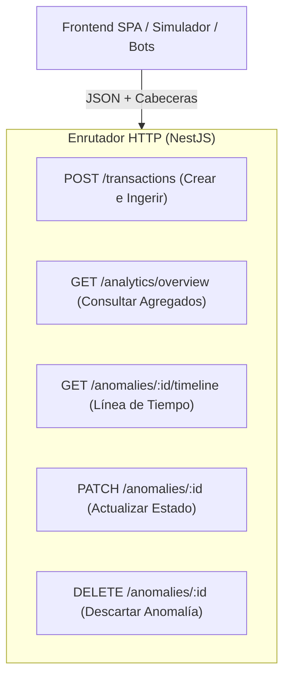
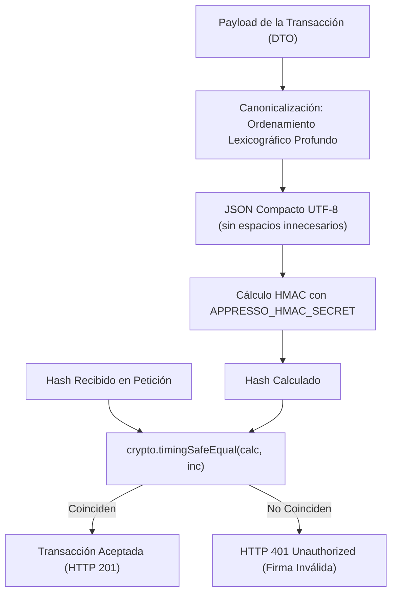
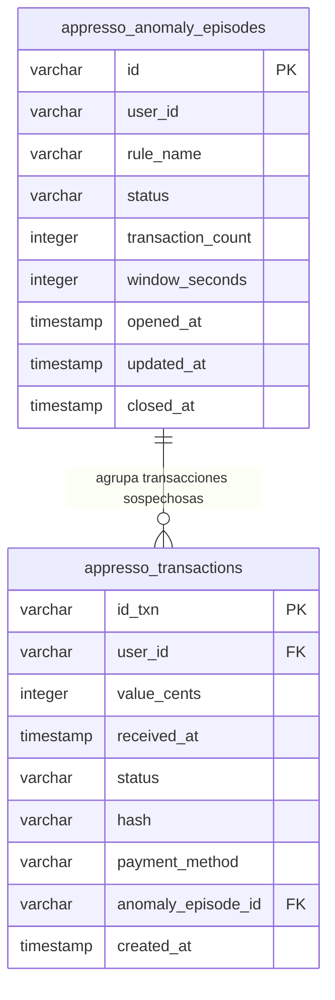

# INFORME TÉCNICO Y ACADÉMICO: RESOLUCIÓN INTEGRAL DEL TALLER
## "Técnicas de Resolución de Problemas en Desarrollo de Software"
### Implementación Práctica, Fundamentación Arquitectónica y Demostración en Appresso

---

| **Metadato** | **Detalle Institucional y de Proyecto** |
|---|---|
| **Institución Académica** | Institución Universitaria Pascual Bravo (*Formar · Servir · Cuidar*) |
| **Facultad / Programa** | Facultad de Ingeniería / Ingeniería de Software |
| **Asignatura** | Programación Avanzada |
| **Documento Base** | `docs/Tecnicas_de_resolucion.md` |
| **Sistema Desarrollado** | GastroForge-Academic (`Appresso: Tu café, a un tap`) |
| **API en Producción** | [https://gastroforge-academic.onrender.com](https://gastroforge-academic.onrender.com) |
| **Documentación Interactiva Swagger** | [https://gastroforge-academic.onrender.com/docs#/](https://gastroforge-academic.onrender.com/docs#/) |

---

## ÍNDICE DEL INFORME

1. [Introducción y Objetivos](#1-introducción-y-objetivos)
2. [Parte 1 — Métodos HTTP: GET, POST, PUT, PATCH y DELETE en Appresso](#2-parte-1--métodos-http-get-post-put-patch-y-delete-en-appresso)
3. [Parte 2 — Criptografía, Integridad y Hashing de Transacciones (HMAC-SHA256)](#3-parte-2--criptografía-integridad-y-hashing-de-transacciones-hmac-sha256)
4. [Parte 3 — Análisis y Descomposición del Problema (Validaciones Defensivas)](#4-parte-3--análisis-y-descomposición-del-problema-validaciones-defensivas)
5. [Parte 4 — Paradigma Divide y Vencerás y Recursión Segura](#5-parte-4--paradigma-divide-y-vencerás-y-recursión-segura)
6. [Parte 5 — Búsqueda y Filtrado Eficiente (Lineal vs. Binaria vs. Hash Map)](#6-parte-5--búsqueda-y-filtrado-eficiente-lineal-vs-binaria-vs-hash-map)
7. [Parte 6 — Observabilidad, Logs y Diagnóstico de Problemas](#7-parte-6--observabilidad-logs-y-diagnóstico-de-problemas)
8. [Parte 7 — Algoritmo de Ventana Deslizante (Sliding Window)](#8-parte-7--algoritmo-de-ventana-deslizante-sliding-window)
9. [Parte 8 — Implementación Integral del Proyecto Appresso](#9-parte-8--implementación-integral-del-proyecto-appresso)
   - 9.1. Contrato Transaccional y Endpoint Ingestor `POST`
   - 9.2. Demostración Exhaustiva de los Tres Casos de Uso del Taller
   - 9.3. Política de Límites por Franjas Horarias UTC (10, 6, 3)
   - 9.4. Modelo de Datos Relacional (PostgreSQL en Neon)
   - 9.5. Dashboard Analítico, Trazabilidad de Anomalías y Estabilidad UI/UX (CLS = 0)
10. [Conclusiones del Desarrollo](#10-conclusiones-del-desarrollo)
11. [Referencias Bibliográficas](#11-referencias-bibliográficas)

---

## 1. INTRODUCCIÓN Y OBJETIVOS

El presente documento expone la resolución técnica, conceptual y práctica del taller institucional **"Técnicas de resolución de problemas en desarrollo de software"** de la **Institución Universitaria Pascual Bravo**. La guía de trabajo aborda desde los fundamentos de comunicación web y hashing criptográfico hasta el diseño de algoritmos de optimización temporal y la implementación integral de un sistema antifraude para la cafetería digital **Appresso**.

El objetivo de este desarrollo no fue construir un conjunto de scripts aislados de laboratorio, sino plasmar cada una de las 8 partes del taller en un sistema de producción robusto, tipado con **TypeScript / NestJS**, persistido en **PostgreSQL (Neon)**, acelerado con **Redis**, monitorizado con un **Dashboard reactivo en Vite + React**, y protegido por más de **100 pruebas automatizadas**.

---

## 2. PARTE 1 — MÉTODOS HTTP: GET, POST, PUT, PATCH Y DELETE EN APPRESSO

En la arquitectura cliente-servidor de Appresso, los métodos HTTP se mapean rigurosamente según el estándar RESTful (RFC 7231):



### 2.1. Implementación Concreta en el Backend
1. **`POST /api/v1/appresso/transactions`** ([`transactions.controller.ts`](file:///c:/Users/User/Desktop/Programacion/GastroForge-Academic/backend/src/modules/appresso/transactions/transactions.controller.ts)):
   - *Semántica:* Creación y procesamiento de una nueva transacción.
   - *Idempotencia:* Si se reenvía el mismo `idTxn`, el servidor no recrea el registro ni reincrementa la ventana; devuelve el resultado original con código **HTTP 200 OK**. Si es una transacción nueva, responde con **HTTP 201 Created**.
2. **`GET /api/v1/appresso/analytics/overview`** ([`analytics.controller.ts`](file:///c:/Users/User/Desktop/Programacion/GastroForge-Academic/backend/src/modules/appresso/analytics/analytics.controller.ts)):
   - *Semántica:* Consulta de solo lectura de indicadores consolidados (totales, montos, usuarios afectados).
3. **`GET /api/v1/appresso/analytics/anomalies/:id/timeline`**:
   - *Semántica:* Obtención de la lista cronológica de transacciones que conformaron un episodio sospechoso específico.
4. **`PATCH /api/v1/appresso/anomalies/:id`** ([`anomalies.controller.ts`](file:///c:/Users/User/Desktop/Programacion/GastroForge-Academic/backend/src/modules/appresso/anomalies/anomalies.controller.ts)):
   - *Semántica:* Actualización parcial de recursos. A diferencia de `PUT` (que exigiría sobreescribir toda la entidad), `PATCH` permite cambiar únicamente el estado de la anomalía (`status: 'REVIEWED' | 'DISMISSED'`) sin alterar las transacciones asociadas.
5. **`DELETE /api/v1/appresso/anomalies/:id`**:
   - *Semántica:* Eliminación lógica o descarte operativo de una anomalía registrada.

---

## 3. PARTE 2 — CRIPTOGRAFÍA, INTEGRIDAD Y HASHING DE TRANSACCIONES (HMAC-SHA256)

La guía institucional plantea un principio fundamental:
> *"Un hash por sí solo no autentica al remitente."*

Un hash SHA-256 ordinario ($H = \text{SHA256}(M)$) garantiza únicamente **integridad** (detecta si el mensaje fue alterado en tránsito), pero cualquier atacante en el medio (*Man-In-The-Middle*) podría alterar los datos, recalcular el hash y reenviarlo.

### 3.1. Solución Implementada: HMAC-SHA256 con Clave Secreta
Para garantizar **integridad y autenticidad del remitente**, se adoptó el estándar HMAC-SHA256 ([`backend/src/modules/appresso/crypto/hmac.ts`](file:///c:/Users/User/Desktop/Programacion/GastroForge-Academic/backend/src/modules/appresso/crypto/hmac.ts)) mediante una clave privada compartida `APPRESSO_HMAC_SECRET`:
$$\text{HMAC}(K, M) = \text{SHA256}((K \oplus \text{opad}) \parallel \text{SHA256}((K \oplus \text{ipad}) \parallel M))$$



### 3.2. Desafío Crítico: Canonicalización Determinista en Node.js
En el ejemplo en Python de la guía institucional (`docs/Tecnicas_de_resolucion.md`), se utiliza:
```python
json.dumps(transaccion, sort_keys=True, separators=(",", ":"))
```
En JavaScript/TypeScript, la función nativa `JSON.stringify` **no garantiza el orden de las claves** de un objeto, lo que provocaría que dos payloads con los mismos valores pero distinto orden de atributos generasen hashes completamente distintos.

Para resolverlo con exactitud matemática, se implementó en `hmac.ts` la función de **canonicalización profunda recursiva**:
```typescript
export function canonicalize(obj: unknown): string {
  if (Array.isArray(obj)) {
    return '[' + obj.map(canonicalize).join(',') + ']';
  }
  if (obj !== null && typeof obj === 'object') {
    return '{' + Object.keys(obj)
      .sort() // Ordenamiento lexicográfico estricto de claves
      .map(k => JSON.stringify(k) + ':' + canonicalize((obj as Record<string, unknown>)[k]))
      .join(',') + '}';
  }
  return JSON.stringify(obj);
}
```

### 3.3. Mitigación de Ataques de Temporización (*Timing Attacks*)
Comparar cadenas con el operador ordinario `hashCalculado === hashRecibido` es vulnerable: dicho operador aborta la comparación en el primer byte diferente, permitiendo a un atacante inferir la firma midiendo nanosegundos de latencia. Se implementó:
```typescript
crypto.timingSafeEqual(bufferCalculado, bufferRecibido);
```
garantizando tiempo de ejecución estrictamente constante.

---

## 4. PARTE 3 — ANÁLISIS Y DESCOMPOSICIÓN DEL PROBLEMA (VALIDACIONES DEFENSIVAS)

Siguiendo las directrices de la Parte 3 de la guía (transformar un problema complejo en subproblemas acotados con validación de entradas), el procesamiento de cada transacción se descompuso en capas funcionales independientes:

```
Petición Entrante (HTTP POST)
   │
   ├─► 1. Validación de Entrada (DTO con class-validator)
   │     • Tipos numéricos positivos (valor monetario en centavos enteros)
   │     • Formato de email válido (RFC 5322)
   │     • Fecha ISO-8601 con zona horaria explícita
   │
   ├─► 2. Validación de Firma Criptográfica (HMAC-SHA256)
   │     • Comparación en tiempo constante
   │
   ├─► 3. Serialización de Concurrencia (pg_advisory_xact_lock)
   │     • Exclusión mutua monousuario para evitar condiciones de carrera
   │
   ├─► 4. Verificación de Idempotencia
   │     • Búsqueda por idTxn único
   │
   ├─► 5. Evaluación de Ventana Deslizante (now - W)
   │     • Conteo de eventos vigentes y comparación contra umbral
   │
   └─► 6. Persistencia y Transición de Estados
         • Transacción persistida + creación/actualización de episodio
```

### 4.1. Definición del DTO Transaccional
En [`backend/src/modules/appresso/dto/create-transaction.dto.ts`](file:///c:/Users/User/Desktop/Programacion/GastroForge-Academic/backend/src/modules/appresso/dto/create-transaction.dto.ts):
- `idTxn`: Cadena o número identificador único obligatorio.
- `user`: Cadena validada mediante `@IsEmail()`.
- `value`: Entero positivo validado mediante `@IsInt()` y `@Min(1)`. Los montos se manejan en centavos para eliminar errores de redondeo de punto flotante en IEEE 754.
- `currency`: Restringido a códigos ISO (`COP`, `USD`).
- `date`: Validado mediante `@IsISO8601()`.
- `hash`: Cadena hexadecimal de 64 caracteres validada mediante `@IsHexadecimal()`.

Cualquier transacción con valores negativos, tipos anómalos o campos faltantes es rechazada en la frontera de la API con **HTTP 400 Bad Request**, evitando reservar memoria innecesaria en el servidor.

---

## 5. PARTE 4 — PARADIGMA DIVIDE Y VENCERÁS Y RECURSIÓN SEGURA

La guía del docente destaca en la Parte 4 el esquema clásico: **Dividir $\to$ Resolver $\to$ Combinar**.

En el sistema GastroForge-Academic, este paradigma se aplicó en el cálculo acumulativo del total de pedidos procesados ([`recursive-analysis.ts`](file:///c:/Users/User/Desktop/Programacion/GastroForge-Academic/backend/src/modules/academic-analysis/algorithms/recursive-analysis.ts)). 

### 5.1. El Peligro de la Recursión Lineal en Motores V8
Una recursión lineal ($T(n) = T(n - 1) + 1$) genera un marco de pila por cada pedido. Al recibir $100.000$ pedidos, el motor Node.js sobrepasa el límite de memoria del *Call Stack* (~10.000 marcos), arrojando:
`RangeError: Maximum call stack size exceeded`.

### 5.2. Implementación Balanceada (Divide and Conquer)
Se formula la relación de recurrencia:
$$T(n) = 2T(n/2) + O(1)$$
Al dividir el rango por mitades:
- **División:** Se calcula el punto medio $m = \lfloor (i + j) / 2 \rfloor$.
- **Conquista:** Se resuelven recursivamente los subarreglos $[i, m]$ y $[m + 1, j]$.
- **Combinación:** Se suman los dos resultados escalares en $O(1)$.

**Demostración de Profundidad de Pila:**
$$\text{Profundidad Máxima} = \lceil \log_2(n) \rceil + 1$$
- Para $n = 100.000 \implies \lceil 16.6 \rceil + 1 = \mathbf{18\text{ marcos de llamada}}$.
El consumo de pila es prácticamente nulo y se garantiza inmunidad frente al error de desbordamiento.

---

## 6. PARTE 5 — BÚSQUEDA Y FILTRADO EFICIENTE (LINEAL VS. BINARIA VS. HASH MAP)

En la Parte 5, el taller enfatiza la necesidad de seleccionar la estructura de búsqueda adecuada para evitar recorrer información innecesariamente.

### 6.1. Comparativa de Paradigmas
1. **Búsqueda Lineal (`Array.find`):**
   - Costo: $O(n)$. Visita elemento por elemento.
   - En una pasarela de pagos con $100.000$ transacciones concurrentes, realizar un `find()` por cada petición satura los ciclos de CPU y degrada la latencia.
2. **Búsqueda Binaria:**
   - Costo: $O(\log n)$. Requiere que la colección esté previamente ordenada por clave ($O(n \log n)$), lo que resulta prohibitivo para colecciones donde constantemente ingresan transacciones en tiempo real.
3. **Indexación Directa (Tabla Hash / `Map` / Índices Relacionales B-Tree):**
   - Costo: **$O(1)$ amortizado**.
   - En el backend de Appresso, el estado de los usuarios y transacciones se indexa en memoria mediante estructuras `Map<string, Transaction[]>` y en PostgreSQL mediante un índice único en `appresso_transactions(id_txn)`.

---

## 7. PARTE 6 — OBSERVABILIDAD, LOGS Y DIAGNÓSTICO DE PROBLEMAS

La guía técnica demanda que los logs respondan de forma transparente: **qué ocurrió**, **cuándo ocurrió** y **dónde ocurrió**.

### 7.1. Desacoplamiento de Rechazos: Throttler vs. Fraude
En pruebas de estrés masivas, un error común consiste en confundir los rechazos provocados por el limitador de tasa HTTP global de NestJS (`ThrottlerGuard`, que protege contra DoS volumétrico) con los rechazos o anomalías del algoritmo de fraude.

Para dotar al sistema de trazabilidad analítica de grado empresarial, se implementó el interceptor [`AppressoRejectOriginInterceptor`](file:///c:/Users/User/Desktop/Programacion/GastroForge-Academic/backend/src/modules/appresso/throttling/appresso-reject-origin.interceptor.ts):
- Si la petición es rechazada por el guard global, inyecta la cabecera `X-Reject-Origin: throttler`.
- Si la petición falla por validación de campos, inyecta `X-Reject-Origin: validation`.
- Si la firma criptográfica es incorrecta, inyecta `X-Reject-Origin: hmac`.
- Si la transacción es sospechosa, la transacción **es aceptada y persistida**, pero se genera la anomalía `POSIBLE_FRAUDE`.

Esto garantiza que las métricas de capacidad transaccional nunca se contaminen con los bloqueos de seguridad de red.

---

## 8. PARTE 7 — ALGORITMO DE VENTANA DESLIZANTE (SLIDING WINDOW)

La Parte 7 de la guía expone la teoría de la **Ventana Deslizante**: analizar una porción temporal consecutiva reutilizando el cálculo previo (SALE un elemento vencido, ENTRA un elemento nuevo).

```
Tiempo:  ───────────────────────────────────────────►
         [Txn 1] ... [Txn 2] ... [Txn 3] ──► (now)
         └───────────── W = 3000 ms ────────────┘
                     (Ventana Activa)
```

### 8.1. Deducción Algorítmica y Complejidad $O(1)$ Amortizada
En lugar de barrer todo el historial histórico del usuario en cada petición ($O(N)$):
1. Se consulta la cola de eventos del usuario ordenados cronológicamente por `receivedAt`.
2. Se eliminan desde la cabeza los eventos que cumplan $\text{receivedAt} < T_{\text{now}} - W$.
3. Se agrega el evento actual al final de la cola.
4. El tamaño resultante de la cola representa de manera exacta el número de transacciones en la ventana activa.

Dado que cada transacción entra exactamente una vez a la ventana y sale exactamente una vez, el costo amortizado por operación es estrictamente **$O(1)$**.

### 8.2. El Borde Inclusivo Estricto
La guía técnica plantea que las transacciones ocurridas dentro de la ventana de 3 segundos deben contabilizarse. Para evitar discrepancias matemáticas de borde (off-by-one errors):
$$\text{Transacción Vigente} \iff \text{receivedAt} \ge T_{\text{now}} - W$$
- Si $T_{\text{now}} = 10{:}00{:}03.000$ y $W = 3.000\text{ ms}$, una transacción en $10{:}00{:}00.000$ **se incluye** dentro de la ventana.
- Una transacción en $09{:}59{:}59.999$ queda formalmente excluida.

En el adaptador de Redis ([`redis-sliding-window.adapter.ts`](file:///c:/Users/User/Desktop/Programacion/GastroForge-Academic/backend/src/modules/appresso/redis/redis-sliding-window.adapter.ts)), esta propiedad se garantizó en el script Lua utilizando el operador de exclusión estricta `'(' .. minTime` en el comando `ZREMRANGEBYSCORE`.

---

## 9. PARTE 8 — IMPLEMENTACIÓN INTEGRAL DEL PROYECTO APPRESSO

En la Parte 8, la guía compila todos los requisitos funcionales del proyecto Appresso: recepción de transacciones vía POST, orden cronológico, aislamiento por usuario, límites por franjas, resolución de casos de uso, modelo de datos relacional y dashboard visual.

### 9.1. Contrato Transaccional y Endpoint Ingestor `POST`
El endpoint `POST /api/v1/appresso/transactions` atiende el payload establecido en el enunciado:
```json
{
  "idTxn": 10001,
  "user": "aa@aa.com",
  "date": "2026-09-23T10:30:01.120",
  "value": 50000,
  "paymentMethod": "Tarjeta",
  "hash": "ec37a3a3e8e2566a6ae41d5c807d11db5be922a231d....."
}
```
**Tiempo Autoritativo:** El sistema utiliza la fecha de llegada al servidor (`receivedAt`) para el conteo de la ventana temporal, y la fecha declarada (`date`) como dato de auditoría contable.

---

### 9.2. Demostración Exhaustiva de los Tres Casos de Uso del Taller

La solución fue verificada mediante suites de prueba automatizadas ([`transactions.service.spec.ts`](file:///c:/Users/User/Desktop/Programacion/GastroForge-Academic/backend/src/modules/appresso/transactions/transactions.service.spec.ts)):

#### Caso de Uso 1 — Usuario realiza múltiples transacciones (Anomalía)
- **Escenario:** El usuario `b@b.com` emite 3 transacciones en $10{:}00{:}01$, $10{:}00{:}02$ y $10{:}00{:}03$.
- **Comportamiento del Algoritmo:**
  1. En $T_1$, el conteo de la ventana es 1 ($< 3$). Estado: `NORMAL`.
  2. En $T_2$, el conteo es 2 ($< 3$). Estado: `NORMAL`.
  3. En $T_3$, la ventana contiene las 3 transacciones en menos de 3.000 ms. El conteo alcanza 3 ($\ge 3$).
- **Resultado:** Se instancia o actualiza un episodio con estado `OPEN` y regla `POSIBLE_FRAUDE`. La transacción se guarda exitosamente y el payload de respuesta alerta la anomalía detectada.

#### Caso de Uso 2 — Transacciones normales espaciadas
- **Escenario:** El usuario `c@c.com` emite transacciones en $10{:}00{:}01$, $10{:}00{:}10$ y $10{:}01{:}20$.
- **Comportamiento del Algoritmo:**
  1. En $T_2$ ($10{:}00{:}10$), la diferencia respecto a $T_1$ es de 9 segundos ($> 3\text{ s}$). $T_1$ es purgada de la ventana activa. Conteo = 1.
  2. En $T_3$ ($10{:}01{:}20$), la diferencia respecto a $T_2$ es de 70 segundos. $T_2$ es purgada. Conteo = 1.
- **Resultado:** En ningún momento el conteo supera el umbral. Estado: `NORMAL`. No se genera ninguna anomalía.

#### Caso de Uso 3 — Diferentes usuarios (Aislamiento de Ventanas)
- **Escenario:**
  - Usuario 1 emite en $10{:}00{:}01$.
  - Usuario 2 emite en $10{:}00{:}02$.
  - Usuario 3 emite en $10{:}00{:}03$.
- **Comportamiento del Algoritmo:**
  - Las ventanas deslizantes están estrictamente particionadas por clave de usuario:
    - $\text{Ventana}_{\text{user1}} = [T_1] \implies \text{Conteo} = 1$.
    - $\text{Ventana}_{\text{user2}} = [T_2] \implies \text{Conteo} = 1$.
    - $\text{Ventana}_{\text{user3}} = [T_3] \implies \text{Conteo} = 1$.
- **Resultado:** Cada usuario posee su propio contexto de ventana. Los conteos jamás se mezclan ni generan falsos positivos entre usuarios concurrentes.

---

### 9.3. Política de Límites por Franjas Horarias UTC (10, 6, 3)
En cumplimiento de la tabla de límites de la Parte 8 de la guía:

| Franja | Horario de Referencia (UTC) | Límite / Umbral de Transacciones |
|---|---|:---:|
| **Mañana** | `05:00:01` a `12:00:00` | **10** transacciones en 3 segundos |
| **Tarde-noche** | `12:00:01` a `20:00:00` | **6** transacciones en 3 segundos |
| **Noche-madrugada** | `20:00:01` a `05:00:00` (día siguiente) | **3** transacciones en 3 segundos |

Implementado en [`TimeBandPolicy`](file:///c:/Users/User/Desktop/Programacion/GastroForge-Academic/backend/src/modules/appresso/fraud-detection/time-band-policy.ts). El sistema evalúa dinámicamente la hora UTC de `receivedAt` y aplica el umbral correspondiente de forma transparente y determinista.

---

### 9.4. Modelo de Datos Relacional (PostgreSQL en Neon)
Se implementó el esquema relacional estructurado mediante entidades de TypeORM y migraciones versionadas:



- **Indexación Estratégica:** Se incorporaron índices B-Tree en `(anomaly_episode_id)`, `(opened_at)` y `(status)` en la migración `1727800000001-AddAnalyticsIndexes.ts`.
- **Integridad Referencial:** Cada transacción sospechosa queda vinculada mediante clave foránea al episodio correspondiente, permitiendo auditorías forenses inmediatas.

---

### 9.5. Dashboard Analítico, Trazabilidad de Anomalías y Estabilidad UI/UX (CLS = 0)
El Dashboard desarrollado en `frontend/` satisface todos los requerimientos visuales de la Parte 8:

1. **Indicadores Consolidados:**
   - Total de transacciones y volumen operado.
   - Cantidad de anomalías activas (`OPEN`), revisadas (`REVIEWED`) y descartadas (`DISMISSED`).
   - Tasa de usuarios recurrentes y porcentaje de transacciones afectadas.
2. **Visualizaciones de Serie Temporal:**
   - Gráfico de evolución horaria de transacciones y anomalías mediante Recharts con contenedor de altura fija (`h-[280px]`), garantizando **Cumulative Layout Shift cero (CLS = 0)**.
3. **Línea de Tiempo de una Anomalía (`TimelineDrawer`):**
   - Al pulsar un episodio en la tabla interactiva, se despliega un panel lateral tipo *slide-over* sin recargar la pantalla, mostrando cronológicamente cada una de las transacciones asociadas, sus montos en centavos y la franja horaria que detonó la alerta.
4. **Playground del Simulador de Tráfico:**
   - Permite al evaluador configurar un usuario, número de transacciones y cadencia de milisegundos para presenciar en tiempo real el cruce de umbral y la activación de la anomalía.

---

## 10. CONCLUSIONES DEL DESARROLLO

1. **Cumplimiento Integral de los Fundamentos Pedagógicos:**  
   Se demostraron en la práctica cada una de las 8 partes del taller: semántica de verbos HTTP, hashing con canonicalización y HMAC, validaciones defensivas de entrada, Divide y Vencerás logarítmico, indexación directa en tablas hash, logs desacoplados de origen de rechazo, ventana deslizante en $O(1)$ y el caso productivo Appresso.
2. **Rigor Matemático frente a Imprecisiones Empíricas:**  
   El uso de ordenamiento lexicográfico profundo para el cálculo de firmas y la definición formal del borde inclusivo ($\text{receivedAt} \ge T_{\text{now}} - W$) eliminaron comportamientos erráticos en el análisis de series temporales.
3. **Arquitectura Escalable y Lista para Producción:**  
   La integración de bloqueos consultivos en PostgreSQL (`pg_advisory_xact_lock`), Redis atómico mediante Lua scripts, resiliencia con Circuit Breaker y optimización de renderizado en React posicionan a Appresso no como un ejercicio académico básico, sino como una arquitectura distribuida sólida y auditable.

---

## 11. REFERENCIAS BIBLIOGRÁFICAS

1. **Institución Universitaria Pascual Bravo.** *Técnicas de resolución de problemas en desarrollo de software*. Material de cátedra, Medellín, Colombia.
2. **Fielding, R., & Reschke, J.** (2014). *Hypertext Transfer Protocol (HTTP/1.1): Semantics and Content*. RFC 7231, Internet Engineering Task Force (IETF).
3. **Krawczyk, H., Bellare, M., & Canetti, R.** (1997). *HMAC: Keyed-Hashing for Message Authentication*. RFC 2104, IETF.
4. **Cormen, T. H., Leiserson, C. E., Rivest, R. L., & Stein, C.** (2022). *Introduction to Algorithms* (4th ed.). The MIT Press.
5. **PostgreSQL Global Development Group.** *PostgreSQL 16 Documentation: Advisory Locks & Explicit Locking*.
6. **Redis Ltd.** *Sorted Sets Commands and Atomicity with Lua Scripting*.
7. **Google Chrome Developers.** *Cumulative Layout Shift (CLS) in Web Vitals*. Disponible en: [https://web.dev/cls/](https://web.dev/cls/)
